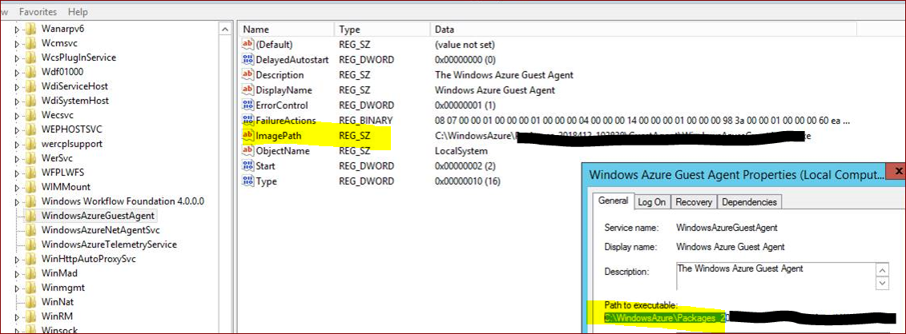

# Windows Azure Guest Agent 服务排错 - 提示找不到路径 WindowsAzureGuestAgent.exe

## 问题描述

您手动更新或者重新安装了 Windows 系统的 [VM 代理](https://docs.azure.cn/zh-cn/virtual-machines/extensions/agent-windows#install-the-vm-agent)。在重新安装后 Windows Azure Guest Agent 服务无法启动，提示找不到路径 WindowsAzureGuestAgent.exe

## 原因分析

注册表中 Windows Azure Guest Agent 指向的路径没有更新。

## 解决方法

1. 在 C:\WindowsAzure\Packages\GuestAgent 文件夹中找到 WindowsAzureGuestAgent.exe 文件
2. 定位到注册表 `HKEY_LOCAL_MACHINE\SYSTEM\CurrentControlSet\Services\WindowsAzureGuestAgent`。
3. 查看 `ImagePath` 的值。
4. 使其指向的路径和 WindowsAzureGuestAgent.exe 所在的路径一致。

    

5. 重启 Windows Azure Guest Agent 服务。

更多问题您也可以访问 [MSDN 上的 Azure 论坛](https://social.msdn.microsoft.com/Forums/zh-CN/home?forum=windowsazurezhchs)。 您可以在这些论坛上发布您的问题。 此外，还可以通过在 [Azure 支持](https://www.azure.cn/support/contact/)站点上选择 “**获取支持**” 来发出 Azure 支持请求。