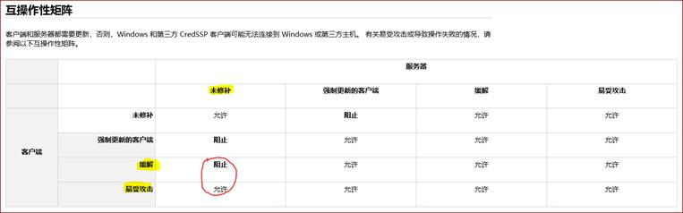
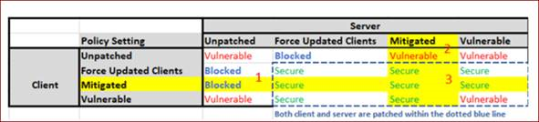

# 如何解决使用 RDP 远程连接 Windows 虚拟机时出现的身份验证错误

## 问题描述

使用 RDP 远程桌面连接 Azure Windows 虚拟机时报错：

“**出现身份验证错误。要求的函数不受支持，这可能是由于 CredSSP 加密 Oracle 修正。**”

## 问题分析

发起远程连接的客户端安装了最新的 5 月累积更新，该更新包含了针对 [CVE-2018-0886 | CredSSP 远程执行代码漏洞](https://portal.msrc.microsoft.com/zh-cn/security-guidance/advisory/CVE-2018-0886)的修复补丁。

由于该补丁会将组策略 “**计算机配置**” -> “**管理模板**” -> “**系统**” -> “**凭据分配**” -> “**加密 Oracle 修正**” 的默认设置从 “**易受攻击**” 更改为 “**缓解**”。

> [!TIP]
> 英文系统的组策略如下： 
> “**Computer Configuration**” -> “**Administrative Templates**” -> “**System**” -> “**Credentials Delegation**” -> “**Encryption Oracle Remediation**”. Default settings changed to “**Mitigated**”.

参考下图的[远程桌面的互操作矩阵](https://support.microsoft.com/zh-cn/help/4093492/credssp-updates-for-cve-2018-0886-march-13-2018)，远程桌面会从 “**允许**” 变为 “**阻止**”。

## 问题总结

1. 如果客户端安装了 5 月的累积更新而服务器（要连接的远程虚拟机）没有安装，远程桌面会被阻止。
2. 如果客户端没有安装更新但服务器端已安装，远程桌面不受限制但是易受攻击。
3. 如果客户端和服务器端都安装了更新，远程桌面会话则安全。

如图所示：

详情请参考：[CredSSP, RDP and Raven](https://blogs.technet.microsoft.com/askpfeplat/2018/05/07/credssp-rdp-and-raven/)。

## 解决方案

1. 通过尚未打补丁的客户端/Azure 虚拟机 登录该虚拟机，安装最新的 5 月累积更新。

    - 2008 R2: [May 8, 2018—KB4103712 (Security-only update)](https://support.microsoft.com/en-us/help/4103712)
    - 2012 R2: [May 8, 2018—KB4103715 (Security-only update)](https://support.microsoft.com/en-us/help/4103715)

    > [!NOTE]
    > 补丁安装需要重启虚拟机。

2. 如果您由于生产环境无法及时重启虚拟机，建议先从未安装补丁的客户端对其进行管理，并建议及时安装补丁并重启以避免被攻击。

3. 您也可以通过在 Azure 支持站点上选择“获取支持”来联系 Azure 技术支持协助您完成 Azure 虚拟机上补丁的安装。

## 更多信息

[After May 2018 security update: RDP "An authentication error occurred" "This could be due to CredSSP encryption oracle remediation".](https://blogs.technet.microsoft.com/yongrhee/2018/05/09/after-may-2018-security-update-rdp-an-authentication-error-occurred-this-could-be-due-to-credssp-encryption-oracle-remediation/)