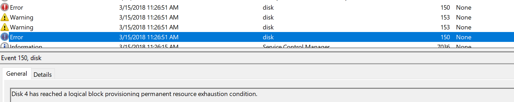
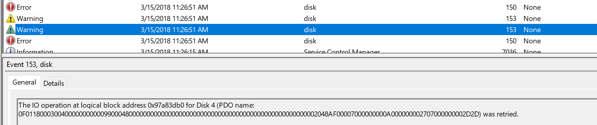
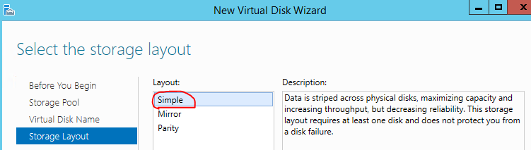
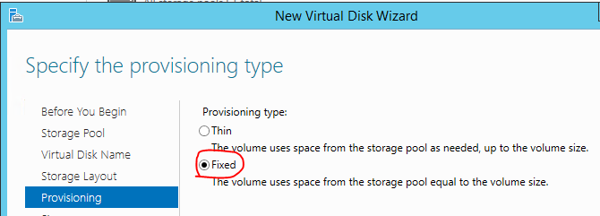

# Azure Windows 虚拟机中逻辑磁盘被强制脱机

## 问题描述

Azure 中创建的 Windows 2012 R2 系统，挂载 2 块 1TB 数据磁盘，组建 Storage Pool 后，创建一个 2TB 的逻辑磁盘，格式化后指定盘符并用于数据读写。使用过程中，该盘突然掉线，从磁盘管理器中能手动上线，但一加载应用，磁盘立即掉线。在系统日志中发现日志报错 150 和 153。从文件浏览器中查看文件系统用量还有大约一半可用。

### 错误信息

```
Disk * has reached a logical block provisioning permanent resource exhaustion condition.
The IO operation at logical block address 0xxxxxxxxx for Disk x (PDO name: xxxxxxxxxxxxxxxxxxxxxxxx) was retried.
```

<br>


## 问题分析

通过命令输出虚拟磁盘的配置信息中包含如下信息。

```powershell
Get-VirtualDisk -FriendlyName  <diskname> | fl

NumberOfAvailableCopies           : 0
NumberOfColumns                   : 1
NumberOfDataCopies                : 2
ProvisioningType                  : Thin
ResiliencySettingName             : Mirror
```

上述信息说明：

1. 逻辑磁盘是采用的 Mirror 方式做的，也就是说两块 1TB 的数据磁盘结合起来，实际上能提供的存储空间最多 1TB。
2. 在创建磁盘是采用了 Thin 的方式。这种方式在创建磁盘时，不会根据实际的存储空间限制磁盘的大小，因此用户能创建远超过实际用量的的逻辑盘，如 2TB，10TB 等。

在这种模式下，当实际写入的数据大于实际存储能提供的容量时，物理存储上已经没有可用空间用于保存数据。为保护数据一致性，系统会强制将文件系统下线，并报告磁盘错误 150 和 153。在空间未得到扩展前，用户只能以只读方式访问该磁盘。

## 解决方法

1. 向 Storage Pool 中添加更多的物理磁盘扩展存储空间。然后 online 磁盘（文件系统）尝试读写。
2. 重建逻辑磁盘，选择 simple 的组织方式和 fixed 磁盘大小。这是 Azure 推荐的方式。因为 Azure Storage 底层本身就是 thin provision 的存储，同时根据存储类型不同，分别有针对数据块的 3 至 6 个副本；Windows 也支持 trim，这两者保证了数据不会因为底层硬件故障而丢失，同时实际使用收费。在虚拟机内部，没有必要再使用 Mirror 和 thin 的方式。

<br>
