# 如何配置 SQL Server 无域 AlwaysOn 可用性组

## 环境准备

1. 创建可用性集：

    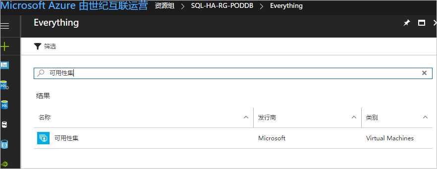

    - 域控制器可用性集 **adavailabilitySetPoddb**
    - SQL Server 可用性集 **sqlAvailabilitySetPoddb**

2. 创建 3 台服务器，并配置为同一个 VNet：

    - DNS 服务器：**dns**
    - 服务器 1：**node1**
    - 服务器 2：**node2**

    > [!NOTE]
    > 1. 在三个服务器上关闭防火墙。
    > 2. node1 和 node2 在同一个可用性集中。

## 操作步骤

1. 设置静态 IP、默认网关以及 DNS 服务器：

    1. 在 [Azure 门户](https://portal.azure.cn)上，配置 3 台服务器使用静态 IP。

        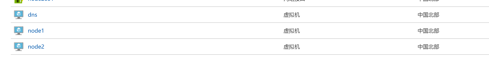

    2. 在 node1 和 node2 中设置静态 IP、默认网关、DNS 服务器 IP：

        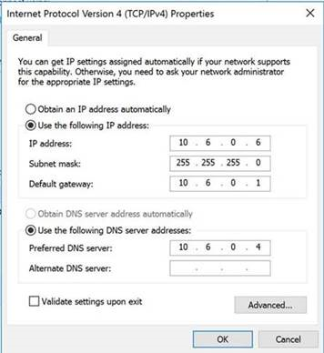

    3. 在 node1 和 node2 中手动修改 DNS Suffix：

        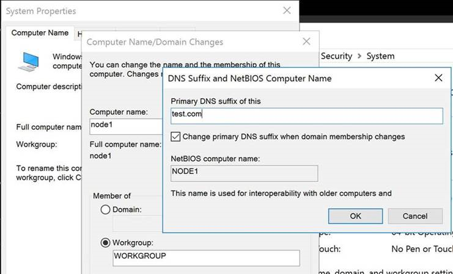

    4. 把 hostname 和对应的 IP 地址写到 C:\Windows\System32\drivers\etc\hosts 文件中。

2. 安装 Cluster：

    1. 在 node1 和 node2 上安装 Failover 服务并创建 Cluster：

        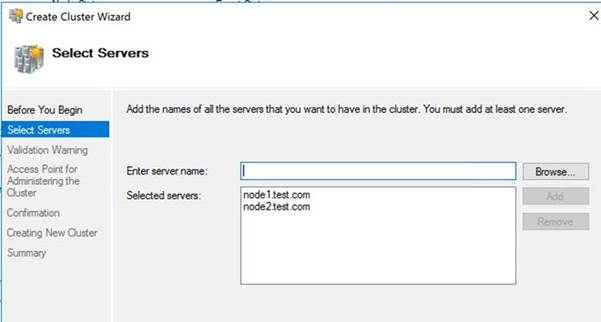

        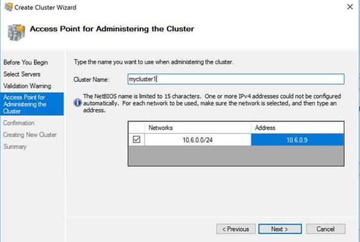

    2. 在 DNS 中创建对应的 AName：

        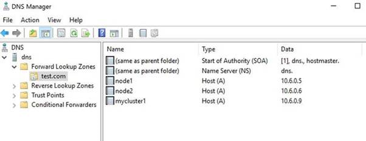

    3. 成功创建 Cluster。

        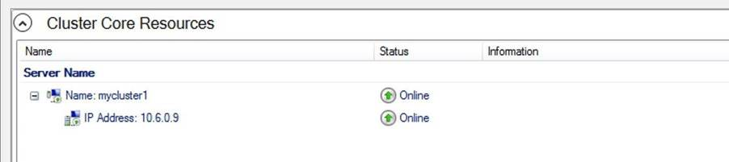

3. 配置 SQL Server 服务：

    1. 在 node1 和 node2 上安装 SQL Server 服务，启动账号设为本地管理员。

    2. 在 SQL Server 上启用 AG 功能。

    3. 配置 AlwaysOn 可用性组，由于节点没有加入 AD 域，所以不能用域认证，只能用证书认证，因此需要创建证书和端点，在配置可用性组之前，各节点进行证书认证，各节点数据库创建的证书都备份并在其他节点还原：

        - 节点 A：创建主密钥/证书/端点，备份证书。使用 SSMS 连接节点 A，执行以下语句：

            ```sql
            USE master
            GO

            -- Create a database master key
            CREATE MASTER KEY ENCRYPTION BY PASSWORD = '1qaz@wsx3edc$rfv'
            GO

            -- Create a new certificate
            CREATE CERTIFICATE SQLBAG_Certificate_Node1_Private
            WITH SUBJECT = 'SQLBAG_Certificate_Private - Node 1',
            START_DATE = '20170801'
            GO

            -- Backup the public key of the certificate to the filesystem
            BACKUP CERTIFICATE SQLBAG_Certificate_Node1_Private
            TO FILE = 'c:\temp\SQLBAG_Certificate_Node1_Public.cert'
            GO

            -- Create an endpoint for the Availability Group
            CREATE ENDPOINT SQLBAG_Endpoint
            STATE = STARTED
            AS TCP
            (
                LISTENER_PORT = 5022
            )
            FOR DATABASE_MIRRORING
            (
                AUTHENTICATION = CERTIFICATE SQLBAG_Certificate_Node1_Private,
                ROLE = ALL,
                ENCRYPTION = REQUIRED ALGORITHM AES
            )
            GO
            ```

        - 节点 B：创建主密钥/证书，备份证书。使用 SSMS 连接节点 B，执行以下语句：

            ```sql
            USE master
            GO

            -- Create a database master key
            CREATE MASTER KEY ENCRYPTION BY PASSWORD = '1qaz@wsx3edc$rfv'
            GO

            -- Create a new certificate
            CREATE CERTIFICATE SQLBAG_Certificate_Node2_Private
            WITH SUBJECT = 'SQLBAG_Certificate_Private - Node 2',
            START_DATE = '20170801'
            GO

            -- Backup the public key of the certificate to the filesystem
            BACKUP CERTIFICATE SQLBAG_Certificate_Node2_Private
            TO FILE = 'c:\temp\SQLBAG_Certificate_Node2_Public.cert'
            GO

            -- Create an endpoint for the Availability Group
            CREATE ENDPOINT SQLBAG_Endpoint
            STATE = STARTED
            AS TCP
            (
                LISTENER_PORT = 5022
            )
            FOR DATABASE_MIRRORING
            (
                AUTHENTICATION = CERTIFICATE SQLBAG_Certificate_Node2_Private,
                ROLE = ALL,
                ENCRYPTION = REQUIRED ALGORITHM AES
            )
            GO
            ```

        - 将节点 B 上生成的 cer 文件拷贝到节点 A 上，然后在节点 A 上执行以下语句：

            ```sql
            CREATE LOGIN Node2Login WITH PASSWORD = '1qaz@wsx3edc$rfv'
            GO

            -- Create user for the login
            CREATE USER Node2User FOR LOGIN Node2Login
            GO

            -- Import the public key portion of the certificate from the other node
            CREATE CERTIFICATE SQLBAG_Certificate_Node2_Public
            AUTHORIZATION Node2User
            FROM FILE = 'c:\temp\SQLBAG_Certificate_Node2_Public.cert'
            GO

            -- Grant the CONNECT permission to the login
            GRANT CONNECT ON ENDPOINT::SQLBAG_Endpoint TO Node2Login
            GO
            ```

        - 将节点 A 上生成的 cer 文件拷贝到节点 B 上，然后在节点 B 上执行以下语句：

            ```sql
            CREATE LOGIN Node1Login WITH PASSWORD = '1qaz@wsx3edc$rfv'
            GO

            -- Create user for the login
            CREATE USER Node1User FOR LOGIN Node1Login
            GO

            -- Import the public key portion of the certificate from the other node
            CREATE CERTIFICATE SQLBAG_Certificate_Node1_Public
            AUTHORIZATION Node1User
            FROM FILE = 'c:\temp\SQLBAG_Certificate_Node1_Public.cert'
            GO

            -- Grant the CONNECT permission to the login
            GRANT CONNECT ON ENDPOINT::SQLBAG_Endpoint TO Node1Login
            GO
            ```

    4. 创建 AG：

        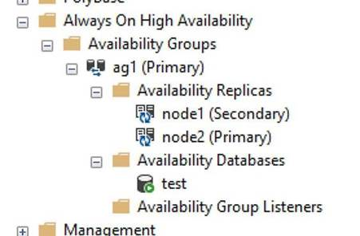

4. 配置负载均衡器：

    1. 在该资源组下面创建 ILB：

        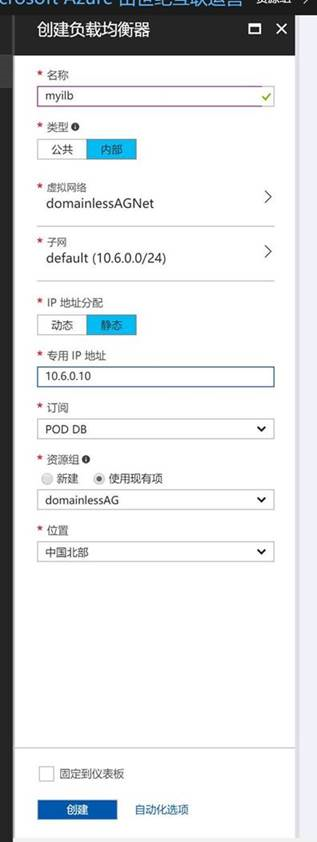

    2. 配置后端池：

        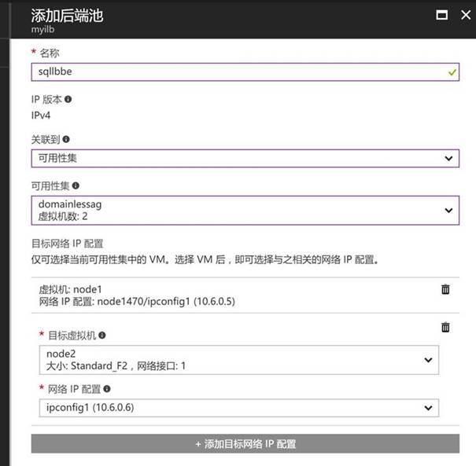

    3. 配置检测：

        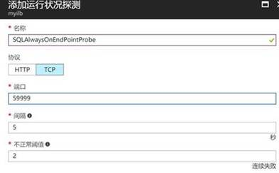

    4. 配置规则：

        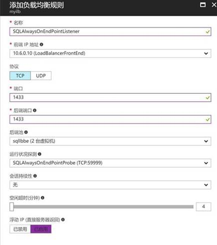

5. 配置 Listener：

    1. 在 DNS 中为 AG Listener 加入需要的 AName：

        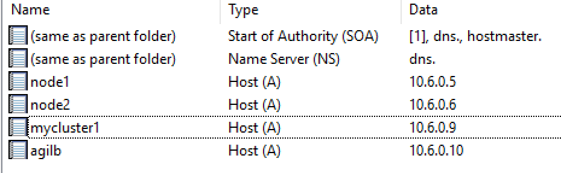

    2. 使用 SSMS 创建 Listener：

        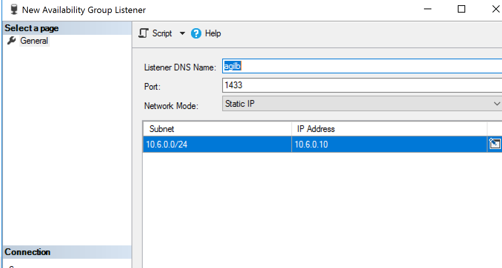

    3. 在两个节点上分别运行的语句：

        ```powershell
        $ClusterNetworkName = "Cluster Network 1" # the cluster network name (Use Get-ClusterNetwork on Windows Server 2012 of higher to find the name)
        $IPResourceName = "ag1_10.6.0.10" # the IP Address resource name
        $ILBIP = "10.6.0.10" # the IP Address of the Internal Load Balancer (ILB). This is the static IP address for the load balancer you configured in the Azure Portal.
        [int]$ProbePort = 59999

        Import-Module FailoverClusters

        Get-ClusterResource $IPResourceName | Set-ClusterParameter -Multiple @{"Address"="$ILBIP";"ProbePort"=$ProbePort;"SubnetMask"="255.255.255.255";"Network"="$ClusterNetworkName";"EnableDhcp"=0}
        ```

    4. 在 Failover Cluster Manager 中将 AG Listener 资源下线再上线：

        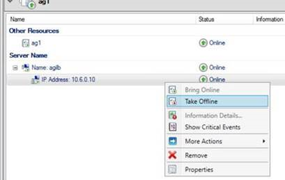

6. 使用 SSMS 进行验证：

    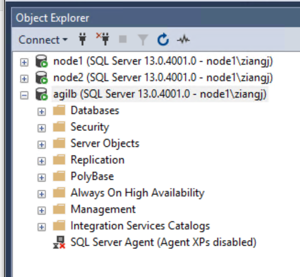