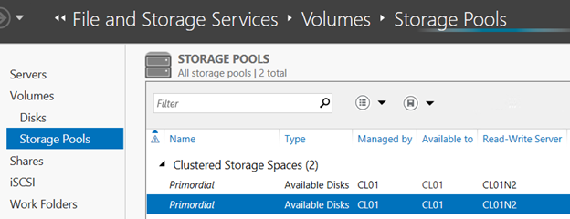
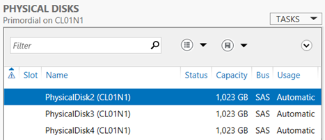
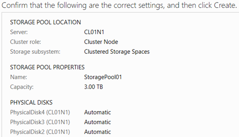
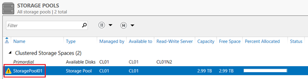
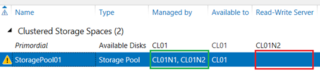
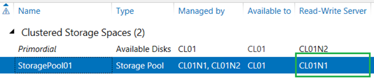
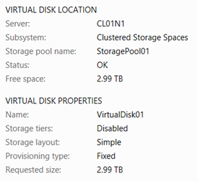
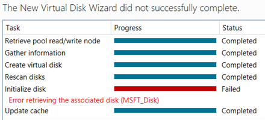
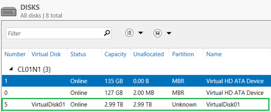

# 在 Azure VM 集群上使用存储空间进行 SQL Server 存储

[存储空间](https://technet.microsoft.com/zh-cn/library/hh831739.aspx) 是 Windows Server 的一项功能，可让您在多个底层物理磁盘中创建虚拟磁盘（也称为存储空间）。[Azure VM 中的 SQL Server 性能指南白皮书](http://download.microsoft.com/download/D/2/0/D20E1C5F-72EA-4505-9F26-FEF9550EFD44/Performance%20Guidance%20for%20SQL%20Server%20in%20Windows%20Azure%20Virtual%20Machines.docx) （第 15 和 26 页）指出，在 Azure VM 中，存储空间可用于提高 SQL Server 工作负载的存储性能。这是通过从条带化的物理磁盘集创建虚拟磁盘来实现的。在 Azure VM 中，物理磁盘使用 Azure Blob 存储，这具有一定的[性能限制](https://docs.azure.cn/zh-cn/storage/storage-scalability-targets) 。但是，在物理磁盘的条带化集顶部创建存储空间可让您在一定程度上解决这些限制。对于支持多个（最多 16 个）物理磁盘的大型虚拟机，可以显著提高存储性能。这可以使 Azure 成为多个 SQL 工作负载的可行平台，否则这些 SQL 负载将受到单个 Azure 磁盘的 I/O 性能的限制。

在某些情况下，例如，当创建新数据库时，就不必再创建存储空间了。 在这种情况下，可以通过使用多数据文件的方式来更加简易的设计数据库，并将每个文件（或一组文件，以实现将来的扩展）放置在单独的物理磁盘上，这样就可以达到类似改进 I/O 性能的效果。 然而，存在某种不可行或不可能的情况，例如， 一个使用大数据文件的现有数据库需要按原样迁移到 Azure 中。

在独立的 Azure VM 中，创建存储空间非常简单。服务管理器会提供一个简单的 UI 来完成此任务。然而，在故障转移集群上使用 Azure VM 作为节点执行此操作就会显得很复杂。这与 SQL Server 有关，因为 AlwaysOn 可用性组（几乎是 Azure VM 中 SQL Server 最常用的 HA 解决方案）需要基础故障转移集群。每个托管可用性副本的 SQL Server 实例都需要本地存储，在 Azure 中则可能需要使用虚拟磁盘作为存储空间来提高 I / O 性能，同时需要在故障转移集群的节点上运行，这就是并发问题产生的原因。当在集群上创建虚拟磁盘时，存储空间使集群中的每个节点都可以访问该磁盘和底层存储池。它还会创建集群资源（池和磁盘），以使集群可以管理存储空间，例如，允许一个节点拥有读写访问权限，而其他节点只拥有只读访问权限。特别需要此集群感知来支持集群共享卷（CSVs），这可以说是在故障转移集群上使用存储空间的主要方案。

然而，巧合的是，在 Azure VM 中不支持此情况。 基于 Azure Blob 存储的磁盘不支持永久保存，因此当存储空间创建新的存储池，并在该池顶部创建虚拟磁盘后，再创建相应的集群资源时，这些资源是无法上线的。

尽管如此，使用存储空间可以在集群节点上创建更好的本地存储，只需手动管理存储池和虚拟磁盘，而不是让集群执行此操作。以下步骤介绍如何将虚拟磁盘作为存储空间添加到双节点故障转移集群节点的过程。 然后，此集群可用于托管具有两个可用性副本的 SQL Server 可用性组的部署，同时数据库驻留在虚拟磁盘的存储空间上。

1. 使用 Azure VMs 创建故障转移集群。 详细的过程不再赘述 - 网络上已有大量教程、演练及脚本。 此示例中的集群名为 `CL01`，两个节点名为 `CL01N1` 和 `CL01N2`。 也可以使用具有两个以上节点的集群。

2. 在 Azure 管理门户中，将三个空磁盘附加到每个节点上。 在本例中，为了简单起见，仅使用三个磁盘。 实际使用的磁盘数量取决于 SQL Server 工作负载的性能需求，并受到 VM 大小的限制。 附加磁盘时，请考虑在单独的存储账户中创建磁盘 Blobs，以避免共享单个存储帐户的性能上限。 Azure 管理门户目前不支持使用非默认存储帐户创建新的空磁盘，但可以使用 `Add-AzureDataDisk` PowerShell cmdlet 来执行此操作。每个磁盘都使用最大容量是没有任何弊处的。 Azure 中的存储是精简配置的，并且是基于实际的空间使用量来计费的。

3. 对于每个节点，启用远程管理。 这可以通过服务管理器在本地服务器的属性中设置。 若未启用远程管理，服务管理器中的服务器清单将无法完成，并且集群中的存储池和磁盘将无法从服务管理器中管理。

4. 在每个节点的服务管理器中，转到"**文件和存储服务**" >> "**磁盘**"，并初始化刚添加的新磁盘。 如果磁盘未出现，请先刷新视图（可能需要几分钟）。 您还可以从存储管理器 MMC 控制台初始化磁盘。磁盘初始化后，请勿创建任何卷。

5. 转到**文件和存储服务 >> 卷 >> 存储池**。 您将看到列出的两个初始存储池，每个节点一个。 当您单击每个初始池时，您可以看到该物理磁盘下所列出的池中的磁盘。

    

    

    在第一个截图中，选择了 `CL01N1` 节点上的初始池，此时节点名称并不是直接可见的，您需要查看第二个截图中显示的池中的磁盘，并注意到每个磁盘名称后面的括号中列出了该节点名称。 请注意，在第一个截图中，这两个池都是由 `CL01` 管理的，而 `CL01` 是集群名称。 这表明默认情况下使用集群存储空间时，集群将会管理池和虚拟磁盘。

6. 在其中一个节点上创建一个新的存储池（在本例中为 `CL01N1` ）。 右键单击其中一个初始池，通过检查物理磁盘列表，记下其所属的节点，然后选择新建存储池。单击向导，给新的存储池命名，并选择要添加到池中的磁盘。 在此示例中，池名称为 `StoragePool01`，并且让它使用已添加到该节点的三个磁盘。

    

    单击“**创建**”，并在所有操作完成后关闭向导。 请注意，该向导不允许您创建少于三个磁盘的存储池。 如果需要双磁盘池，则解决方法是首先创建一个三磁盘池，然后在该池顶部创建虚拟磁盘之前从池中删除物理磁盘。

7. 回到服务管理器中，您将看到一个名为 `StoragePool01` 的新存储池，但是旁边有一个警告标志，阻止在此池顶部创建一个虚拟磁盘。 该池中的三个磁盘旁边显示着相同的警告信号。

    

    服务管理器中没有明确的指示表明为何会显示此警告。 但是，如果打开 **故障转移集群管理器** 并转到“**存储** >> **池**”，您会看到名为“集群池 1”的新集群资源已被列出，其状态为“失败”。 如前所述，由于此池中的磁盘不支持永久保存，集群无法将资源上线。

8. 删除“集群池 1 ”的资源。 回到服务管理器，刷新视图。 一旦刷新完成（可能需要几分钟），请注意，存储池旁边的警告标志仍然显示，但是每个磁盘旁边的警告标志都会消失。 值得注意的是，存储池现在显示为由单个集群节点（`CL01N1`，`CL01N2`）管理，而不是像之前那样由集群管理。 请注意，**读写服务器列**中的值为空，这意味着两个节点都不能写入池。 因此，虚拟磁盘创建仍然会被阻止。

    

9. 右键单击存储池，然后选择设置读写访问。 确保选择的节点位于此存储池附加的磁盘之中。 这使得在该节点上该池可写入，从而可以在此池上创建一个虚拟磁盘。 请注意，存储池旁边的警告标志现在已经消失，同时节点名称（CL01N1）显示为读写服务器。

    

10. 右键单击刚刚创建的存储池，然后选择新建虚拟磁盘。 点击向导，给新的虚拟磁盘命名，选择“简单”作为布局，并使用池的最大容量。 在此示例中，虚拟磁盘的名称为 `VirtualDisk01`。 简单布局将对存储池中的所有磁盘进行条带化，这样可提供与 RAID 0 相似的最大性能，但无冗余性。这可能听起来并不是一个好的 SQL Server 存储方案，但请记住，在这种情况下，磁盘是由 Azure Blob 存储的，其实已经提供了三重冗余了。

    

11. 点击 “**创建**”，该向导将运行任务，但是初始化磁盘任务将失败：

    

12. 正因如此，失败的原因还是由于集群资源的失效。 打开故障转移群集管理器，并注意现在有两个新的资源被添加。 其中一个还是名为 Cluster Pool 1 的池，另一个是名为 Cluster Virtual Disk（VirtualDisk01）的磁盘。 磁盘处于“**失败**”状态，并且池处于脱机状态。 删除这两个资源，先删除磁盘再删除池。

13. 回到服务管理器，刷新视图。 您将看到存储池和新虚拟磁盘在其旁边都有警告标志。 参见之前的步骤，将存储池上的读写访问权限设置到磁盘再次附加到的节点上。 这将删除存储池旁边的警告标志，但虚拟磁盘旁边的标志仍然存在。 这是因为虚拟磁盘尚未附加到对于底层存储池具有读写访问权限的节点上。

14. 右键单击虚拟磁盘，然后选择 ”**附加虚拟磁盘**”。 确认提示后，您会看到警告标志已经消失。 现在，如果您转到服务管理器中的”**文件和存储服务**>>**卷**>>**磁盘**”，您将在所有磁盘列表中看到新的虚拟磁盘。

    

    新磁盘同样列在磁盘管理 MMC 控制台中。

15.  初始化新磁盘，并创建一个新的简单卷。 这可以在服务管理器或磁盘管理控制台中完成。 这与在新磁盘上创建新卷的常规过程没有什么不同。 使用磁盘管理器可能更简单，因为它不依赖于可用的远程管理。

16. 目前来看，好像已经完成了，新的磁盘也可以使用了。 其实，还是一个非常重要的步骤。 请注意，在上一步中，我们需要手动附加新的虚拟磁盘。 默认情况下，使用集群存储空间，虚拟磁盘并不会在其可用或服务器启动时自动连接，因为它们由集群管理。 但是我们必须删除集群资源，这样才能自己有效地管理虚拟磁盘。 这意味着我们必须确保在服务器重新启动时虚拟磁盘是可用的。 存储空间提供名为 IsManualAttach 的虚拟磁盘属性。 默认情况下，在群集存储空间中，该属性设置为 “**True**”。 但为了在服务器重新启动时自动附加磁盘，此属性必须设置为 ”**False**”。

17. 服务管理器并不提供用于更改 IsManualAttach 属性的 UI 界面，尽管它提供了所有虚拟磁盘属性的只读视图，包括此属性。 因此，我们必须使用 PowerShell（顺便提及，所有此前任务步骤都可以在 PowerShell 中完成）。 打开管理员权限的 PowerShell 命令提示符，然后执行 `Get-VirtualDisk cmdlet `。 该命令会输出刚刚创建的磁盘的属性。 请注意，`IsManualAttach` 属性已设置为 “**True**”。 输入并执行以下命令： `Set-VirtualDisk -FriendlyName VirtualDisk01 -IsManualAttach $ False`。 再次执行 `Get-VirtualDisk` 以确认该属性已被更改。

    

18. 此时，磁盘已处于待用状态。 此例中，我们基于三个物理磁盘创建了一个虚拟磁盘，当然其他配置自然也是可行的。 在大型 Azure VM 上，最多可以使用 16 个物理磁盘来创建一个或多个存储池和虚拟磁盘。

19. 然后，在集群的所有其他节点上重复以上步骤。

最后，在此申明， Microsoft Azure 是一个快速变化的环境，这个博客是根据目前的状态（2014 年春季）编写的。 本博客中提供的一些信息在未来发展中可能会有所改变或无效。

**2014-07-14 更新**：新 Azure 存储磁盘条带化指南作为 [Azure 虚拟机中 SQL Server 的性能最佳实践](https://docs.azure.cn/zh-cn/virtual-machines/windows/sql/virtual-machines-windows-sql-performance) 中的一部分最近已经发布。在配置 SQL Server 使用 Azure 存储之前，特别是关于”磁盘和性能注意事项” 一节时, 请参阅本话题。

**2014-08-08 更新**：首先说明一下，这些步骤适用于已经创建好集群，当前需要在每个节点上添加本地存储空间的场景。如果从零开始构建集群，则在集群构建之前将本地存储空间添加到每个节点将变得更加容易，然后将存储添加到集群中将轻而易举。

**2014-11-16 更新**：在将新节点添加到上述存储空间配置的现有集群的情况下，如果选择将可用存储添加到集群的选项，则集群尝试从现有节点添加存储池和虚拟磁盘，此时将不可从本地进行访问。要解决此问题，请按照上述步骤，删除群集对象，允许在存储池上进行写访问，附加虚拟磁盘（并再次将 `IsManualAttach` 设置为 "**False**"），然后使磁盘上线。