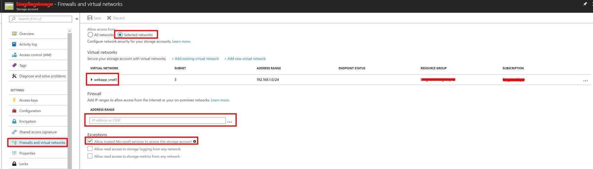
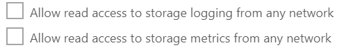
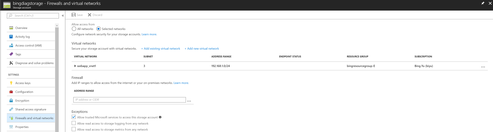
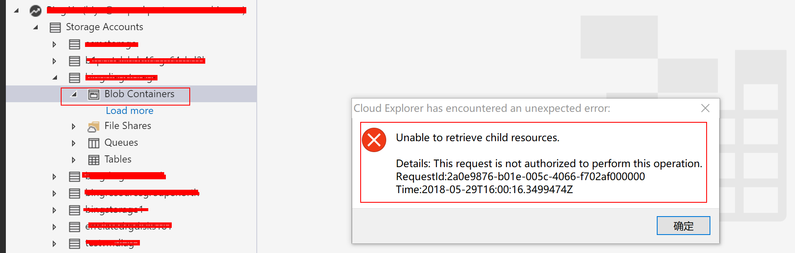

# 虚拟网络服务终结点结合存储账号的防火墙规则的使用实例分享

## 场景描述

存储账号的防火墙规则如果选择了 **selected networks**，就会按照白名单机制，不在白名单中的地址将无法访问存储账号。 
例如如果没有在虚拟网络中添加受信任的虚拟网络以及子网，即没有在 Firewall 中添加任何 IP 地址段，存储账号将拒绝所有访问。

如上，只添加了某个虚拟网络，稍等片刻后，会发现使用 Storage Explorer 通过 Internet 访问存储账号时被拒绝，如下所示：

白名单机制，即只允许所列出的虚拟网络或 Internet 地址段可以访问此存储账号资源，同样也可以限制访问的内容：

### 点到站点 VPN 场景

针对 P2S VPN 拨入此受信任的客户端，是否可以访问存储账号？

经确认，是不可以的，因为 P2S VPN 拨入的地址空间是属于另外的 VPN 地址池空间，区别于虚拟网络子网的空间，而按照 P2S VPN 客户端所下发的路由来看，通过 Storage Explorer 工具访问存储账号，目的 IP 是 Azure 的公网 IP，故此客户端 PC 还是会按照默认路由，通过本地网关，经公网出口 IP 访问此存储账号，所以只将此 P2S VPN 所在的虚拟网络加入白名单，仍然无法访问存储账号中的资源。

然而当我们将此客户端的 Internet 出口 IP 加入到此存储账号的防火墙运行地址段中后，确又可以访问存储账号中的资源了，我们对此也进行了测试以验证此结论。

### 验证过程

1. 只将点到站点 VPN 网关所在的虚拟网卡所有子网加入允许虚拟网络中：

    

2. 拨入 vpn:

    

3. 通过 Microsoft Azure Storage Explorer 访问此存储账户，失败：

    

4. 但如果将此 PC 所连入的网络的 Internet 出口 IP 加入 Firewall 规则地址段中：

    

5. 稍等片刻后，再次尝试，发现已可以访问：

    

有关在虚拟网络中通过服务终结点访问存储账户或是 Azure PaaS SQL 服务的优点，请参考：
[虚拟网络服务终结点](https://docs.azure.cn/zh-cn/virtual-network/virtual-network-service-endpoints-overview#key-benefits)。
