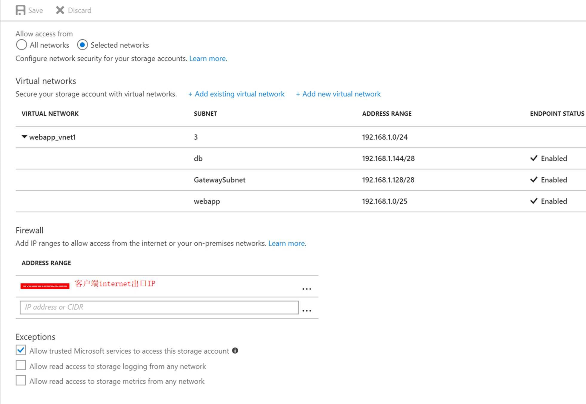
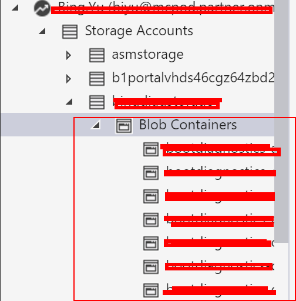

# 虚拟网络终结点如何与存储账号防火墙规则配合使用

## 场景描述

存储账号的防火墙规则如果选择了 **Selected networks**，就按照白名单机制。 
如果没有在虚拟网络中添加受信任的虚拟网络以及子网，而且没有在 Firewall 中添加任何 IP 地址段，存储账号将拒绝所有访问。

如上，只添加了某一个虚拟网络。等待 3 分钟左右，会在客户端 Storage Explorer 中通过 Internet 访问存储账号被拒绝，如下：

白名单机制，即只允许所列出的虚拟网络或 Internet 地址段可以访问此存储账号资源，当然也可以限制访问的内容：

## 场景分析

对于点到站点 VPN 场景，针对 P2SVPN 拨入此受信任的客户端，是否可以访问存储账号的问题？ 
经确认，是不可以的。因为 P2S VPN 拨入的地址空间是属于另外的 VPN 地址池空间，区别于虚拟网络子网的空间，而按照 P2S VPN 客户端所下发的路由来看，通过 Storage Explorer 工具访问存储账号，目的 IP 是 Azure 的公网 IP，故此客户端 PC 还是会按照默认路由，通过本地网关，经公网出口 IP 访问此存储账号，所以只讲此点到站点 VPN 所在的虚拟网络加入允许，确认仍然无法访问存储账号中的资源。

当我们将此客户端的 Internet 出口 IP 加入到此存储账号的防火墙运行地址段中后，确实有可以访问存储账号中的资源了，我们提供测试也验证了此结论。

## 验证步骤

1. 只将点到站点 VPN 网关所在的虚拟网卡所有子网加入允许虚拟网络中：

    

2. 拨入 vpn:

    

3. 通过 Microsoft Azure Storage Explorer 访问此存储账户，失败：

    

4. 将此 PC 所连入的网络的 Internet 出口 IP 加入 Firewall 规则地址段中：

    

5. 等待大约 5 秒钟，再次尝试，发现可以访问了（如下图）：

    

有关在虚拟网络中通过服务终结点访问存储账户或是 Azure PaaS SQL 服务的优点，请参考：
[虚拟网络服务终结点](https://docs.azure.cn/zh-cn/virtual-network/virtual-network-service-endpoints-overview#key-benefits)。