# 使用 OpenSwan 打通 Azure RouteBased VPN 和 PolicyBased VPN

## 问题描述

如果客户在 Azure 上分别创建了 Route-Based 和 Policy-Based，并且想要打通这两个虚拟网络的访问，由于这是两种不同类型的 VPNGateway 以及采用不同版本的 IKE 协议去协商，所以 Azure 的 Route-Based 跟 Policy-Based 的 VPNGateway 是无法直接打通（关于两者的区别可以参考：[VPN 类型](https://docs.azure.cn/zh-cn/vpn-gateway/vpn-gateway-about-vpn-gateway-settings#vpntype)。），我们可以尝试在中间找一台 VPN 设备或者 Linux 虚拟机安装第三方 VPN 软件来帮助我们打通两个虚拟网络，本文主要讨论如何使用 Linux 虚拟机安装 OpenSwan 来打通这两个虚拟网络。

## 目的

如何实现 Subversion 跟 VM2 通过内网 IP 实现互访

## 拓扑

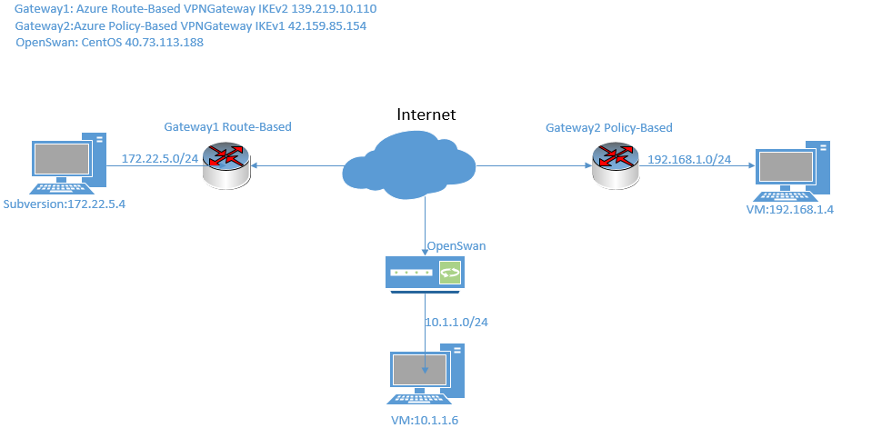

## 前期准备

1. 创建一个 Route-Based 的虚拟网络网关 Gateway1 以及虚拟网络 172.22.5.0/24，并新建一台虚拟机名称 Subversion(172.22.5.4)
2. 创建一个 Policy-Based 的虚拟网络网关 Gateway2 以及虚拟网络 192.168.1.0/24，并新建一台虚拟机名称 VM2（192.168.1.4）
3. 新建一个虚拟网络 10.1.1.0/24 ，并且在该虚拟网络中添加两台虚拟机：OpenSwan 以及 VM1 (10.1.1.5)

## 配置

1. 创建本地网络网关

    1. 为 Route-Based VPNGateway 创建本地网络网关 openswan4route-based：

        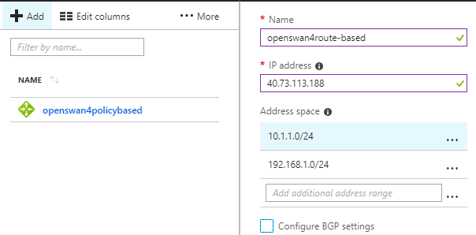

    2. 为 Policy-Based VPNGateway 创建本地网络网关 openswan4policy-based：

        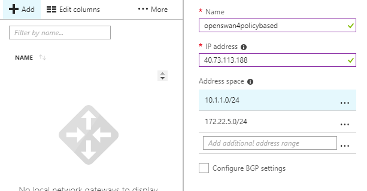

2. 配置 Route-Based VPNGateway：

    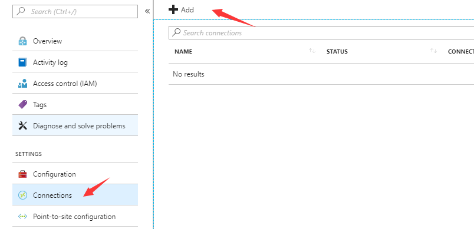

    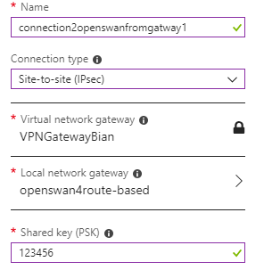

3. 配置 Policy-Based VPNGateway：

    

    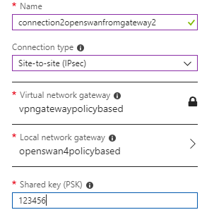

4. 安装配置 OpenSwan：

    1. 安装：

        

    2. 调整系统配置以及内核参数：

        ```shell
        chkconfig iptables off
        service iptables stop
        setenforce 0
        sed -ri "s/SELINUX=enforcing/SELINUX=disabled/g" /etc/selinux/config
        sed -ri 's/net.ipv4.ip_forward = 0/net.ipv4.ip_forward = 1/g' /etc/sysctl.conf
        sed -ri 's/net.ipv4.conf.default.rp_filter = 1/net.ipv4.conf.default.rp_filter = 0/g' /etc/sysctl.conf
        sysctl -a |egrep "ipv4.*(accept|send)_redirects" | awk -F "=" '{print $1 "= 0"}'  >>/etc/sysctl.conf
        sysctl -p
        ```

    3. 配置：

        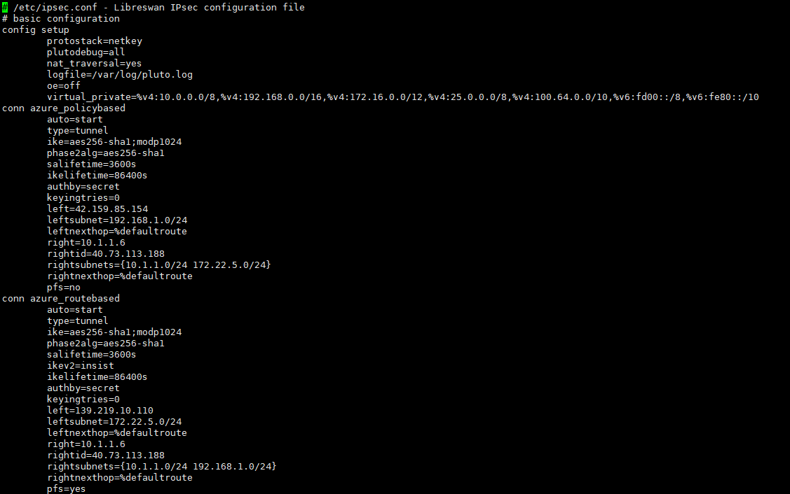

        关于 OpenSwan 的配置文件各参数的含义可以参考 `man ipsec.conf`。

        配置预共享密钥：

        

        重启服务以及查看状态, 可以看到状态都已经 active：

        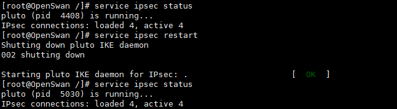

5. 在 Azure 门户里面针对 OpenSwan 的 NSG Inbound 规则放行 udp500,4500。

    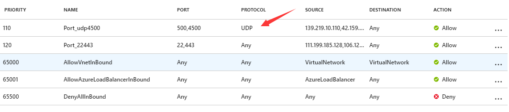

## 测试

我们在 172.22.5.4 上 `ping  -c 100 192.168.1.4` 测试结果如下所示：

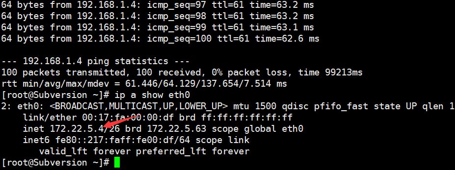

我们在 192.168.1.4 上 `ping -c 100 172.22.5.4` 测试结果如下所示:

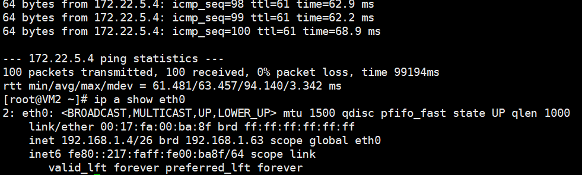

可以看到两边测试均没有丢包并且延迟抖动也都正常。

如果后续想要 VM1 跟 VM2 和 Subversion 互相访问，可以在 VM1 的子网上挂 UDR 实现。