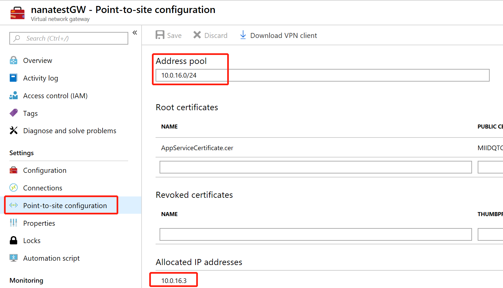
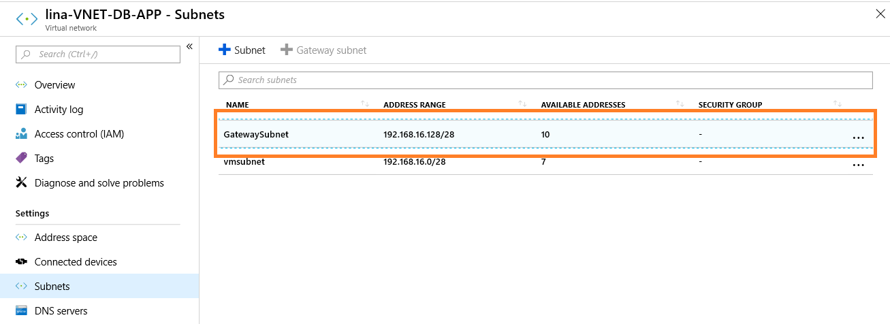
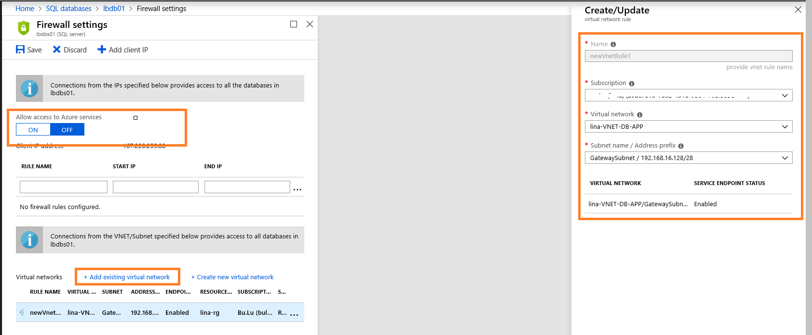
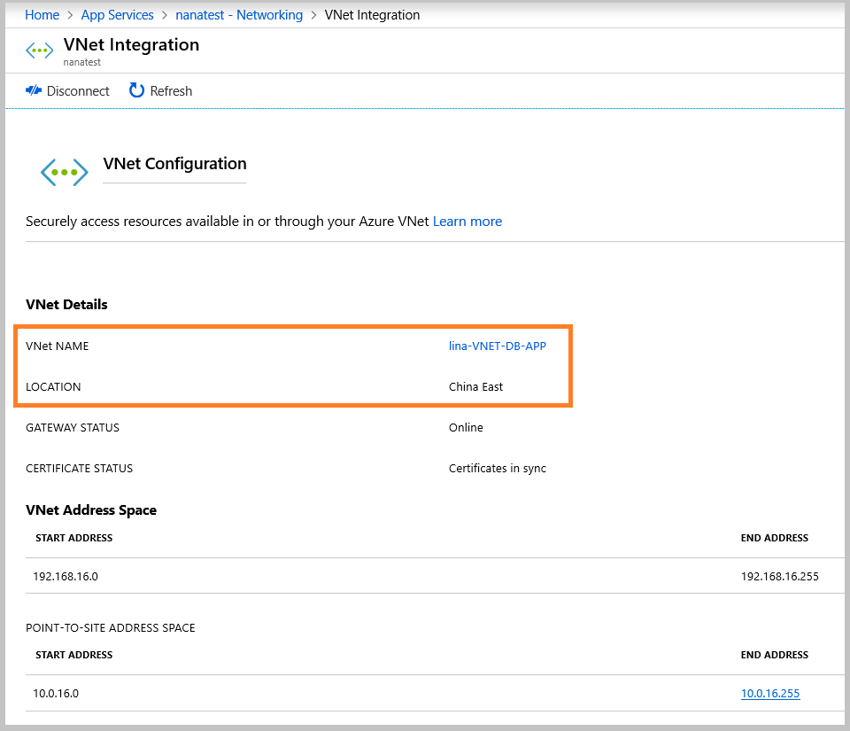
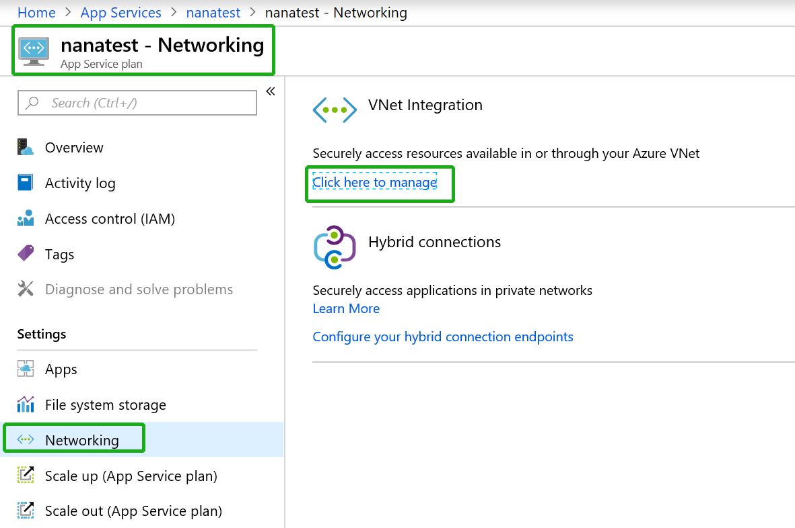
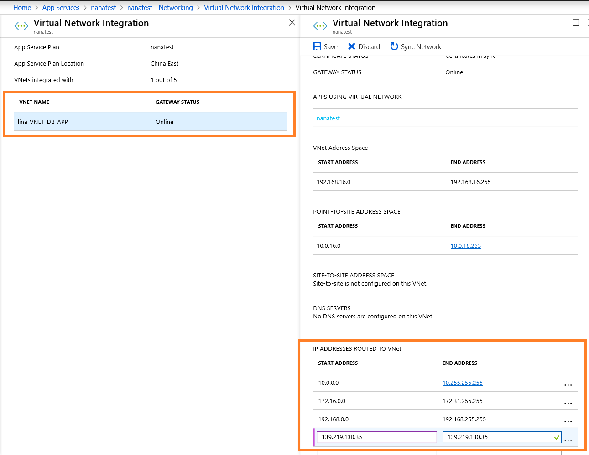
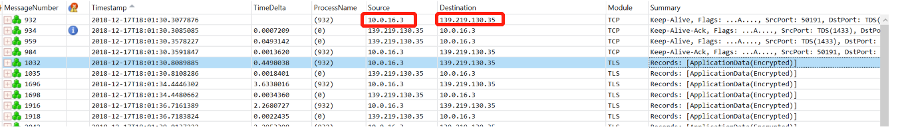

# 虚拟网络 (VNET) 集成应用服务应用通过内网访问 Azure SQL 数据库服务

在实际应用中，客户有 Web 应用访问 SQL 数据库的需求，而为了实现数据的安全访问，客户更希望从内网进行访问，而 Web 应用和 SQL 数据库作为 PaaS 资源，正常情况下都是通过公网进行访问的，针对客户希望从内网进行访问的这种需求，我们验证这个需求可以通过虚拟网路来集成应用程序应用，以及 Azure SQL 开通 **服务终结点** 的方式来实现。

## 准备工作

* 一个应用服务应用，请参阅 [Web 应用文档](https://docs.azure.cn/zh-cn/app-service/)。
* 一个 Azure SQL 数据库服务，请参阅[创建 Azure SQL 数据库](https://docs.azure.cn/zh-cn/sql-database/sql-database-get-started-portal)。
* 一个虚拟网络，请参阅[创建虚拟网络](https://docs.azure.cn/zh-cn/virtual-network/quick-create-portal)。

在创建以上资源的时候，请选择同一区域。

本方案中关键点在于：

* 将 P2S VPN 的 GatewaySubnet 开启 Microsoft.sql 的服务终结点， 并且在 SQL 服务中关联。

* 如果允许 Azure 内部虚拟机对 SQL 的访问，可以将虚拟机所在的子网添加服务终结点，指定特定的子网地址对数据库进行访问，不在该子网内的一切资源(虚拟机， Web 应用)不允许访问数据库服务。

* 在应用服务计划中，需要添加 SQL 数据库服务的 IP 范围到路由规则 (IP ADDRESSES ROUTED TO VNET) ，目前在中国区的数据库服务 IP 地址为下表，请参考：[Azure SQL Database gateway IP addresses](https://docs.microsoft.com/en-us/azure/sql-database/sql-database-connectivity-architecture#azure-sql-database-gateway-ip-addresses)。

    | 区域 | IP 地址 |
    | :---- | :---- |
    | China East 1 | 139.219.130.35 |
    | China East 2 | 40.73.82.1 |
    | China North 1 | 139.219.15.17 |
    | China North 2 | 40.73.50.0 |

## 操作步骤

1. 创建虚拟网络并添加子网：

    1. 在虚拟网络中创建 VPN，并配置 P2S 地址池：

        

    2. 为 GatewaySubnet 开启 Microsoft.sql 服务终结点， 也可以在配置 SQL 服务时选择对应的子网再进行开启：

        

2. 设置 SQL 数据库防火墙规则：

    1. 关闭 "Allow Access to Azure Service"。

    2. 添加在上一步中创建的虚拟网路，并选择只允许应用程序访问的子网。

        

3. 在应用服务中集成第一步中的虚拟网络：

    

4. **非常关键**，在应用服务计划中为虚拟网络添加 ROUTE 规则，加入第二步中数据库服务的 IP 地址，根据不同的分区查找对应的 IP 地址，请参考文章开头部分的表格。

    1. 进入应用服务计划 -> 网络 -> 虚拟网络集成：

        

    2. 在 "IP ADDRESS ROUTED TO VNet" 添加中国东部 1 的数据库服务 IP 地址 139.219.130.35。

        正常情况下 Web 应用访问 SQL 应用会使用底层默认路由， 将数据包通过公网发送，而 Web 应用无法手动添加路由，将发往公网 SQL 服务的数据下一跳指向 P2S VPN， 所以这一步的主要目的是为 Web 应用添加优选路由，将 SQL 服务的路由以 Vnet 类型的方式发布到 Web 应用上。

        

> [!NOTE]
>每一次更改 IP address route to vnet 中的地址段时， Web 应用都会进行重新拨号，会为 Web 应用重新分配一个 P2S IP 地址。

完成以上四步后，可以看到 Web 应用拨号的 P2S 地址为 10.0.16.3，通过在 VPN 上抓包可以观察到，Web 应用发起的向 SQL 的请求都是经过了 VPN 的，即下一跳指向 VPN，验证了是通过内网访问的。

在这个方案中，虽然验证了可以通过内网去访问 SQL 服务， 但是整个通信过程中涉及到 P2S 拨号，服务终结点（强制隧道）等多个技术， 访问的情况建议持续观察一段时间。

## 参考文档

* [应用与 Azure 虚拟网络进行集成](https://docs.azure.cn/zh-cn/app-service/web-sites-integrate-with-vnet)
* [为 SQL 数据库创建服务器级防火墙规则](https://docs.azure.cn/zh-cn/sql-database/sql-database-get-started-portal-firewall)
* [使用虚拟网络服务终结点](https://docs.microsoft.com/zh-cn/azure/sql-database/sql-database-vnet-service-endpoint-rule-overview#azure-portal-steps)