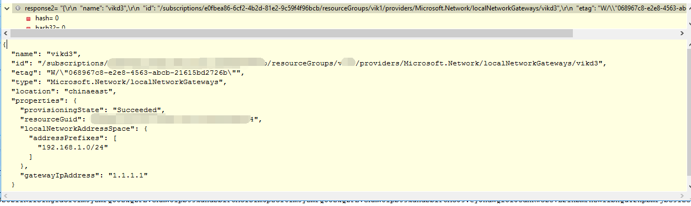

# Java 调用虚拟网络本地网关的 REST API

## 准备工作

首先在 Azure 中创建好虚拟网络本地网关。

## 解决方法

1. 获取 Token :

    {
        this.tokenCredentials = new ApplicationTokenCredentials(clientId, tentant, clientSecret,
        AzureEnvironment.AZURE_CHINA).withDefaultSubscriptionId(subId);                   
                        
        AzureEnvironment environment = tokenCredentials.getEnvironment();
        String loginUrl = environment.getAuthenticationEndpoint();
        String managementUrl = "https://management.chinacloudapi.cn/"; 
        String tenantId = tokenCredentials.getDomain();
        String clientId1 = tokenCredentials.getClientId();
        String secret = tokenCredentials.getSecret();
        String accessToken = null;
        URL url = new URL(String.format(loginUrl + "%s/oauth2/token?api-version=1.0", tenantId));
        System.out.println(url.toString());
        HttpsURLConnection conn = (HttpsURLConnection) url.openConnection();
        conn.setRequestProperty("Content-Type", "application/x-www-form-urlencoded");
        conn.setDoOutput(true);
        DataOutputStream output = new DataOutputStream(conn.getOutputStream());
        byte[] data = String.format("grant_type=client_credentials&resource=%s&client_id=%s&client_secret=%s",managementUrl, clientId, URLEncoder.encode(secret, "UTF-8")).getBytes();
        if (data != null)
            output.write(data);
        output.flush();
        output.close();
        InputStream input = conn.getErrorStream();
        if (input == null)
            input = conn.getInputStream();
        String response = null;
        try (Scanner scanner = new Scanner(input)) {
            scanner.useDelimiter("\\Z");
            response = scanner.next();
            scanner.close();
            input.close();
        }
            
        if (response != null) {
            JSONObject json = mapper.readValue(response, JSONObject.class);
            Object obj = json.get("access_token");
            accessToken = (obj == null ? null : obj.toString());
        }
        getRest(accessToken);
    }

2. 调用虚拟网络网关 REST API：

    public void getRest(String token) throws URISyntaxException, IOException{
        String resourceManagerUrl = "https://management.chinacloudapi.cn";
        String[] str = resourceManagerUrl.split("://");
        String scheme = str[0], authority = str[1], filter = "api-version=" + "2017-03-01";
        String requestUrl = String.format("/subscriptions/%s/resourceGroups/%s/providers/Microsoft.Network/localNetworkGateways/%s?",
                "subid", "vik1", "vikd3");
            
        URL url2 = new URI(scheme, authority, requestUrl, filter, null).toURL();
        System.out.println(url2.toString());
        HttpsURLConnection conn2 = (HttpsURLConnection) url2.openConnection();
        conn2.setRequestProperty("Authorization", "Bearer " + token);
        int responseCode = conn2.getResponseCode();
        InputStream input2 = conn2.getErrorStream();
        if (input2 == null) {
            input2 = conn2.getInputStream();
        }
                
        String response2 = null;
        try (Scanner scanner2 = new Scanner(input2)) {
            scanner2.useDelimiter("\\Z");
            response2 = scanner2.next();
            scanner2.close();
            input2.close();
        }
        if (responseCode != 200) {
            throw new RuntimeException(response2);
        }
    }

返回结果如下：

