# 如何解决使用 nslookup 工具发生异常域名解析行为

在很多虚拟机网络问题排查过程中，常常会需要测试域名解析的情况。大多数人首先想到的，就是使用系统自带的 nslookup 工具。为什么呢？命令简单易用，无需安装节省时间。

本文我们就通过一个小问题来研究研究 nslookup 这个命令进行 DNS 解析的过程。

## 问题描述

用户在使用虚拟机的时候出现了应用程序运行出错的现象，日志中记录解析不到远程地址。 
用户通过 nslookup 查看分析，发现是 DNS 出现了问题。解析的明明是 `asmsqlsa.blob.core.chinacloudapi.cn`，但却返回了 `asmsqlsa.blob.core.chinacloudapi.cn.test.com`。

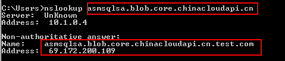

## 问题分析

`test.com` 是用户私有网络中的 AD 域，在公网域中并没有这个记录，并且用户想要解析的是公网中的域名 `asmsqlsa.blob.core.chinacloudapi.cn`。

难道是 DNS 服务器出了问题？通过抓包进行分析，发现客户端发起的请求就已经是 `asmsqlsa.blob.core.chinacloudapi.cn.ad02.test.com`，服务器没有解析到，随后又发起了解析 `asmsqlsa.blob.core.chinacloudapi.cn.test.com` 的请求，服务器解析成功并并返回结果。

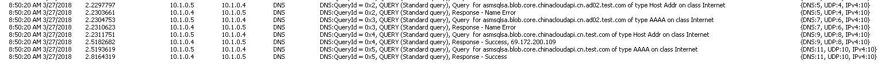

至此，我们发现需要解决该问题的关键就是如何配置客户端 DNS 请求不带域名后缀。 
文档[使用组策略指定 DNS 后缀](https://technet.microsoft.com/zh-cn/library/cc959267.aspx)中提到组策略可能影响 DNS 后缀，但此处我们的环境中并没有配置任何组策略。

在[TCP/IP 高级设置](https://technet.microsoft.com/zh-cn/library/cc959339.aspx)中我们也没有配置强制添加 DNS 后缀。此处 **Append parent suffixes of the primary DNS suffix** 选项只会影响域名的 devolution 解析。

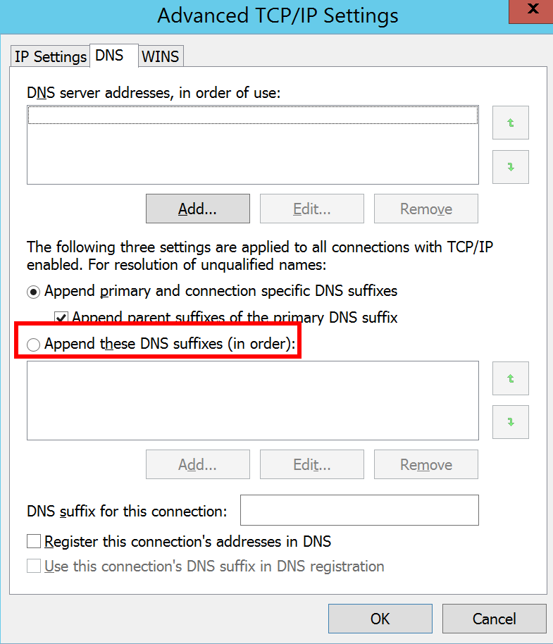

通过 `ipconfig` 命令进行查看，我们发现 **DNS Suffix Search List** 中指定了搜索的 DNS 后缀为 `ad02.test.com`。是否是该选项影响了 nslookup 的行为呢？

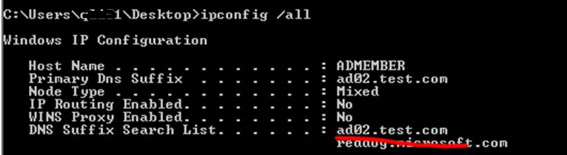

虽然在 TCP/IP 高级设置中并没有配置添加的 DNS 后缀，但在域中的机器会默认将其域配置为 **Search List**。 
如下配置则为不添加任何域（Azure 中虚拟机会断开连接，需要重启恢复连接）。

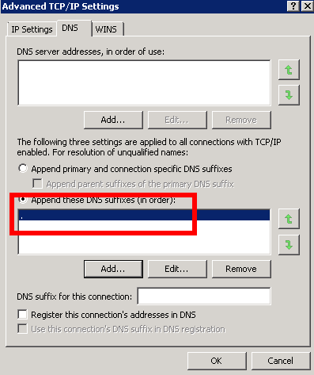

再看 **DNS Suffix Search List** 已经为空了。此时再使用 nslookup 发现终于返回我们想要的解析结果了。

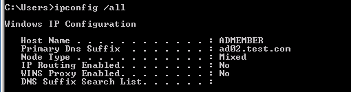 
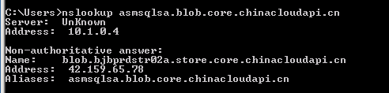 
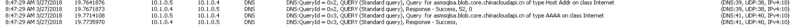

通过以上分析我们大致能判断出应该是 **DNS Suffix Search List** 影响了解析行为。 
那么，接踵而至的问题就是为什么在其他 AD 域中，就没有这样的情况呢？

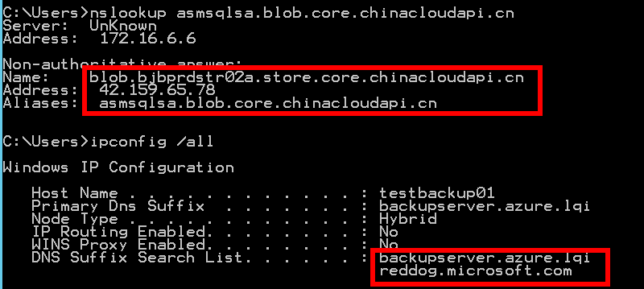

同样，抓包的结果给了明确的线索：第一次 DNS 请求，带了 **DNS Suffix Search List** 中的后缀，服务器没有解析到，随后客户端又发起了解析 **asmsqlsa.blob.core.chinacloudapi.cn.azure.lqi** 的请求，没有结果；又再次发送了解析 **asmsqlsa.blob.core.chinacloudapi.cn** 的请求，得到回复。

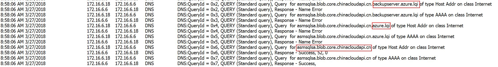

也就是说能不能返回预期结果，需要明确以下两点：

1. DNS 发送的 query 中有没有包含额外的 DNS 后缀。
2. 带后缀的域名能不能被 DNS 服务器正常解析。

我们在第三台服务器上分别向公网 DNS 服务器发送了解析请求 `asmsqlsa.blob.core.chinacloudapi.cn.azure.lqi` 和 `asmsqlsa.blob.core.chinacloudapi.cn.test.com`。 
发现确实 `asmsqlsa.blob.core.chinacloudapi.cn.test.com` 能被解析到。

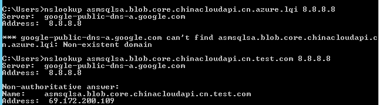

在进一步了域名的组织后，就能合理地解释了在不同情况下 nslookup 的表现不同的原因了。

1. 域名最准确的格式是 `object.domain.com.` （最末尾有个点，代表是根域）。

    当 nslookup 中输入一个不带点的域名时（如 `object.domain.com`），nslookup 会将其认为是一个子域名，会带上 **DNS search list** 中定义的后缀（这里以 `ad01.mydomain.com` 为例）后向 DNS 发起查询。

2. DNS 的请求过程根据环境中的 DNS 设置，可能只在内网中进行，但也可能会进入公网，该请求会持续到有 DNS 服务器返回成功或失败。

    如果失败，在勾选了 **Append parent suffixes of the primary DNS suffix**选项，nslookup 会进行 devolution 查询（`object.domain.com.mydomain.com`）；如果没有勾选，则会直接接查询用户输入的域名 `object.domain.com`。 
    在某一级查询成功后，nslookup 就返回结果，不再继续；如果所有的查询都失败，则返回找不到域。

3. 在上面案例中，`test.com` 这个域名是在公网存在的，因此解析以这个结尾的域名就能返回结果；而 `azure.lqi` 是个不存在的域名，nslookup 就会继续解析不带后缀的域名。

    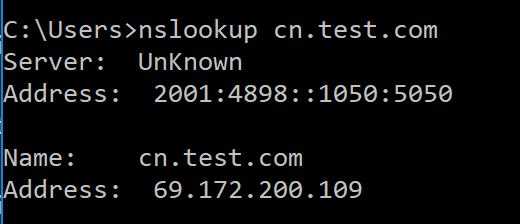

更改 **DNS suffix search list** 会影响不带域名的短名的解析，因此不推荐这种方式。 
如果在排查问题期间需要解析域名，有以下两个建议：

1. nslookup 全局域名时最后带上点号。

    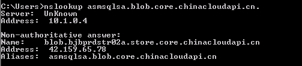

2. 结合第三方工具如 dig 等综合分析。

    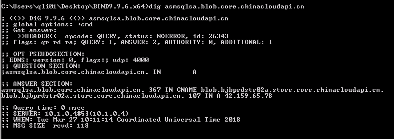