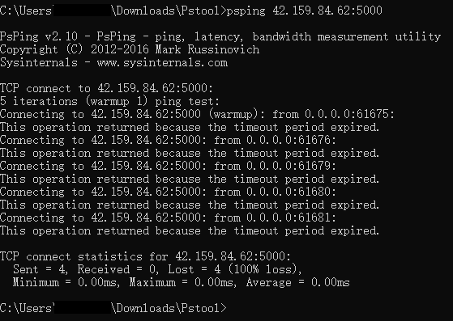
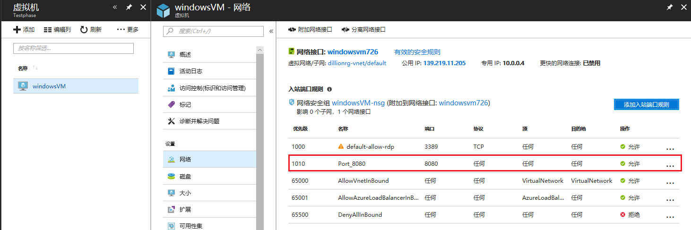
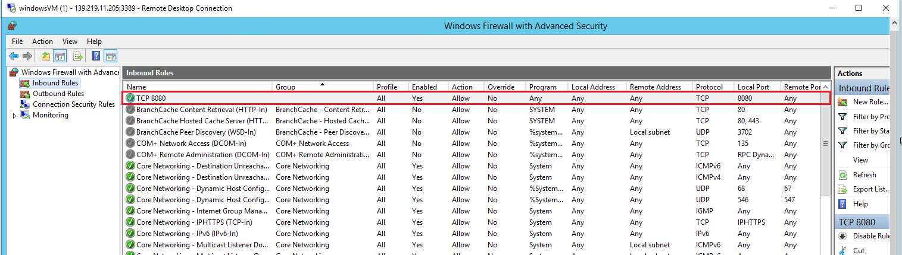
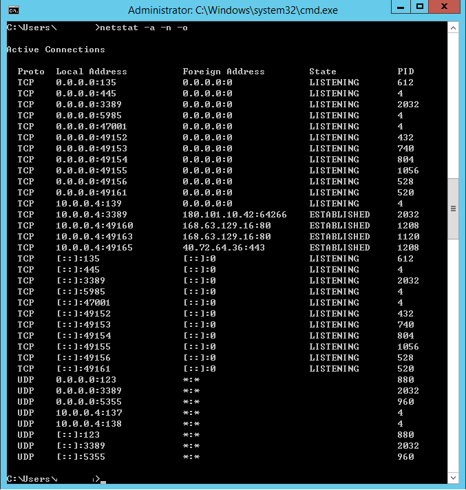
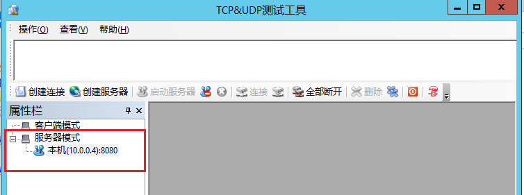
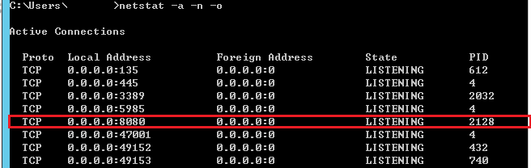
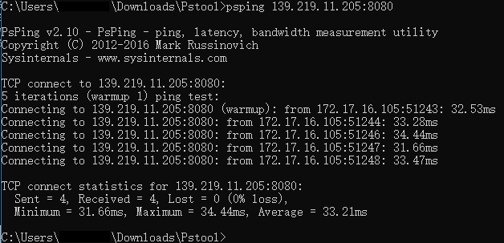

# 使用 PsPing 无法 ping 通 Windows 虚拟机端口

## 问题描述

用户参考 [使用 PsPing & PaPing 进行 TCP 端口连通性测试](https://docs.azure.cn/articles/azure-operations-guide/virtual-network/aog-virtual-network-tcp-psping-paping-connectivity) 对 Windows 虚拟机做端口测试，在 [Azure 门户](https://portal.azure.cn) 中为 Windows 虚拟机添加了入站端口规则 (例如：5000 端口)，但是使用 PsPing 做端口测试时，可以 ping 通 3389 端口(Azure Windows 虚拟机默认开通的远程端口)，但是无法 ping 通新添加的入站端口，遇到以下错误：



## 问题分析

此错误可能由以下原因造成：

1. [网络安全组入站端口被禁用](#section1)

2. [Windows 防火墙未打开相应的端口](#section2)

3. [虚拟机中端口未处于 "LISTENING" 状态](#section3)

本文创建一台 Windows server 2012 虚拟机，以 8080 端口为例详细解释该问题，具体步骤如下。

## <a id="section1"></a>网络安全组入站端口规则被禁用

网络安全组将按优先级顺序来检查规则。 一旦应用某个规则，不再检查其他规则的匹配情况。所以请根据优先级检查入站端口规则，确保入站端口规则有效且处于 "允许" 状态。



有关网络安全组优先级详细信息，请参阅[使用网络安全组筛选网络流量](https://docs.azure.cn/zh-cn/virtual-network/virtual-networks-nsg#nsg-resource)。

## <a id="section2"></a>Windows 防火墙未打开相应的端口

在网络安全组有效的情况下，请求通过网络安全组入站端口后被虚拟机防火墙阻止。请远程到虚拟机，查看虚拟机的防火墙规则，并添加相应的出入站规则并启用。



## <a id="section3"></a>虚拟机中端口未处于 "LISTENING" 状态

在网络安全组出入站规则和虚拟机防火墙出入站规则有效且处于 "允许" 状态下，可以使用以下命令查看虚拟机端口状态：

```
netstat -a -n -o
```

结果输出如下：



通过截图我们没有找到 8080 端口，表明虚拟机 8080 端口未处于 "LISTENING" 状态。

可以使用以下方法使虚拟机 8080 端口处于 "LISTENING" 状态：

1. 在虚拟机上部署 Web 应用，并设置应用端口为 8080 端口，然后启用应用。

2. 使用 TCP&UDP 测试工具，在 Windows 虚拟机上创建服务器并监听 8080 端口。

在 Azure 虚拟机上下载 TCP&UDP 测试工具，打开 TCP&UDP 测试工具，右键点击服务器模式，使用 8080 端口创建服务器，然后启动服务器。



使用上面方法设置完监听端口后，使用 `netstat -a -n -o` 命令查看端口状态，可以看出 8080 端口已处于 "LISTENING" 状态。



使用 PsPing 在客户端测试 Azure Windows 虚拟机连接性，可以看出 8080 端口已经可以 ping 通，结果如下：

