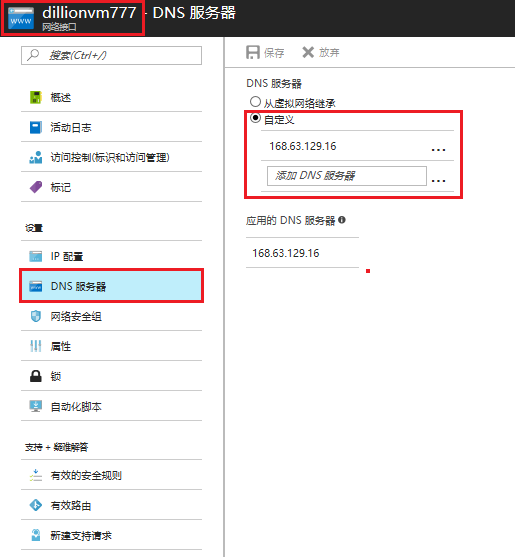
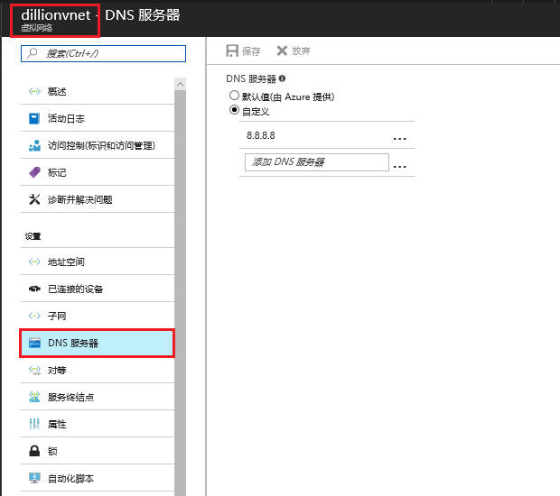

# 如何排查虚拟网络中虚拟机无法访问网络的问题

虚拟网络中的虚拟机有时会遇到可以远程连接，但是无法在虚拟机中访问外网的问题。本文主要提供一些常见的故障排除方法来帮助你解决此问题。

如果本文未解决你的 Azure 问题，请访问 [MSDN 上的 Azure 论坛](https://social.msdn.microsoft.com/Forums/home?forum=windowsazurezhchs)， 你可以在这个论坛上发布你的问题。 此外，还可以通过在 [Azure 支持](https://www.azure.cn/support/contact/)站点上选择联系方式来发出 Azure 支持请求。

## 症状

虚拟网络中的虚拟机可以通过远程连接访问，但是无法访问外部网络。

## 故障排除指南

* [检查网络流量是否被网络安全组（ NSG ） 阻止](#checknsg)
* [检查网络流量是否被 VM 防火墙阻止](#checkfirewall)
* [检查自定义 DNS 服务器 IP 地址的有效性](#checkdns)

## 故障排除步骤

请按照下列步骤排查问题，完成每个步骤后，检查问题是否得到解决。

###  步骤 1：检查网络流量是否被网络安全组（ NSG ） 阻止

在 Azure 虚拟机侧边栏中选中 "网络" ，查看网络安全组出站端口规则，是否禁用公共 Internet 出站访问。如果处于禁用状态，修改或删除该规则并保存。

例如：如下图所示，“AllowInternetOutBound” 为 NSG 默认规则，允许虚拟机访问外部网络。“DenyInternetOutBound” 为新添加的 NSG 规则，禁止访问外部网络。由于 “DenyInternetOutBound” 的优先级高于 “AllowInternetOutBound” 的优先级，所以最终会使用 “DenyInternetOutBound” 规则，禁止虚拟机访问外部网络。

> [!Note]
> NSG 将按照优先级顺序来检查规则。所有 NSG 都包含一组默认规则。 默认规则无法删除，但由于给它们分配的优先级最低，可以用创建的规则来重写它们。所以检查 NSG 规则时，请注意优先级。

更多有关 NSG 的详细信息，请参阅[什么是 NSG ](https://docs.azure.cn/virtual-network/virtual-networks-nsg)以及[如何使用门户管理 NSG](https://docs.azure.cn/virtual-network/virtual-networks-create-nsg-arm-pportal)。

###  步骤 2：检查网络流量是否被 VM 防火墙阻止

禁用防火墙，然后测试结果。 如果问题得到解决，则验证防火墙设置，然后重新启用防火墙。

###  步骤 3：检查自定义 DNS 服务器 IP 地址的有效性

在 Azure 虚拟机侧边栏中选中 "网络" ，点击该虚拟机使用的网络接口，在网络接口侧边栏中选中 DNS 服务器，查看正在使用的 DNS 服务器信息。

如果您在网络接口中使用的是自定义的 DNS 服务器，请检查 DNS 服务器 IP 地址是否有效，并适用于当前环境。可以尝试修改 IP 地址，使用 Azure 默认 DNS 服务器或者公共 DNS 服务器去测试，例如："8.8.8.8" (由 Google 提供，全球通用 DNS ) 或者 "168.63.129.16" (该地址为 Azure 默认 DNS 服务器地址)。

> [!Note]
> 为云服务/网络接口指定 DNS 服务器时，其优先级高于为虚拟网络指定的 DNS 服务器。
> 如果更改已部署的虚拟网络/虚拟机的 DNS 设置，则需重新启动每个受影响的 VM，所做的更改才会生效。

如果您在网络接口中使用的 DNS 服务器是从虚拟网络中继承的，请在 Azure 虚拟网络中，选中当前正在使用的虚拟网络，在虚拟网络侧边栏中点击 "DNS 服务器" 查看 DNS 服务器信息。

同样如果在虚拟网络中使用自定义 DNS 服务器，也可以尝试使用一些公共 DNS 服务器，例如： "8.8.8.8" (由 Google 提供，全球通用 DNS )，或者选择 "**默认值**" 使用由 Azure 提供的默认 DNS 服务器（ IP 地址为 "168.63.129.16" ）。

如果使用 Azure 默认 DNS 服务器或者公共 DNS 服务器后虚拟机可以访问外网，说明问题与之前使用的 DNS 服务器 IP 地址有关，请修改为有效的 IP 地址或者使用 Azure 默认 DNS 服务器。

如果本文未解决你的 Azure 问题，请访问 [MSDN 上的 Azure 论坛](https://social.msdn.microsoft.com/Forums/home?forum=windowsazurezhchs)， 你可以在这个论坛上发布你的问题。 此外，还可以通过在 [Azure 支持](https://www.azure.cn/support/contact/)站点上选择联系方式来发出 Azure 支持请求。