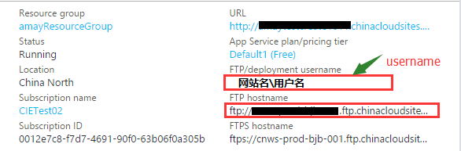
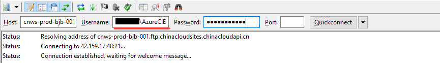
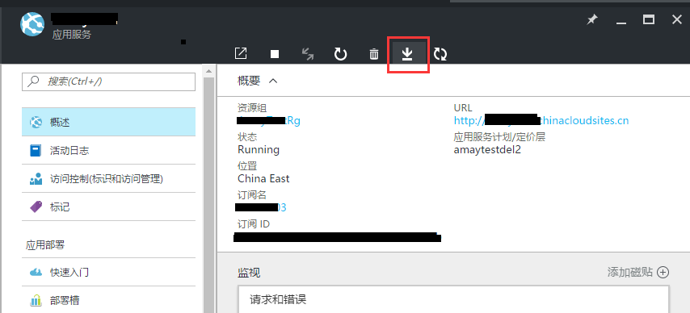
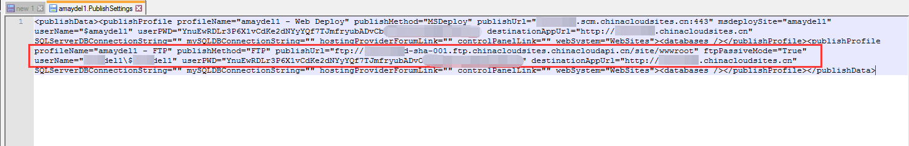
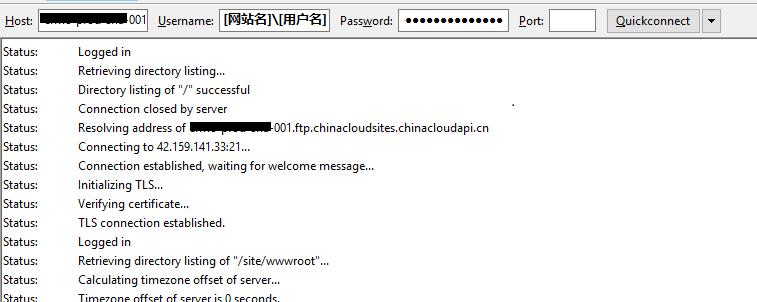
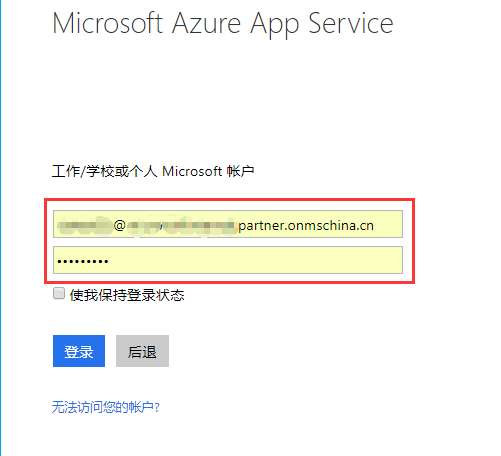
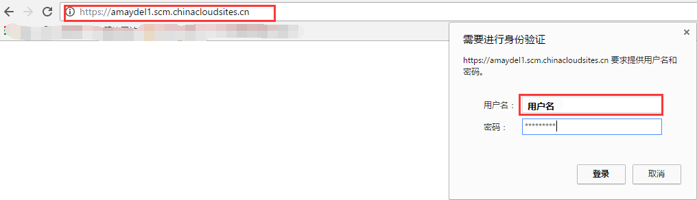

# 登录 Azure Web 应用 FTP 服务器和 Kudu 站点的几种方法

## 登录 FTP 服务器

### 使用 FTP 部署用户名和密码登录

> [!TIP]
> 一个订阅下的所有网站的用户名和密码是同一个，如果更改用户名和密码其他网站登录时也要采用新的用户名和密码登录。

1. 登录信息您可以在网站页面获取 :

    > [!NOTE]
    > FTP 部署用户名格式应为【网站名\用户名】

    

2. 在 FTP 中登录时，所填信息类似如下：

        Host：ftp://*******-001.ftp.chinacloudsites.chinacloudapi.cn
        Username；[网站名\用户名]
        Password：XXXX[您自己的 FTP 密码]

    

### 使用发布配置文件进行 FTP 登录

> [!Tip]
> 如果想要每个网站有独立的维护人时可以采取这种模式。

具体步骤如下：

1. 下载网站的发布配置文件

    

2. 使用文本编辑器打开该文件。在此文件中查找 FTP 的相关信息，如下截图信息：`PublishProfileName, publishMethod, publishUrl, ftpPassiveMode, userName, userPWD`。

    其中 `publishUrl, userName, userPWD` 是在登录 FTP 时需要的信息。

    

3. 在第三方 ftp 客户端登录。

    

## 登录 Kudu 站点：

> [!Tip]
> Azure 为每一个 web 应用都配置了 Kudu 站点，网站的 Kudu 站点可以方便对网站进行管理，kudu 登录的方式主要为以下两种：

### 使用 Azure 账号登录

登录 URL 为： https://[网站名].scm.chinacloudsites.cn 

具体步骤见下例：

1. 在浏览器中输入登录 URL：https://[网站名].scm.chinacloudsites.cn/

2. 在账号和密码框中输入 Azure 的账号和密码即可登录。

    

    > [!NOTE]
    > 如果是已经在浏览器中登录 Azure 门户， 则无需输入任何内容会直接跳转到 Kudu 首页。

### 使用 FTP 账号登录

以下两种登录的URL为：https://[网站名].chinacloudsites.cn/basicauth 

#### 使用 FTP 用户名和密码登录

具体步骤见下例：

1. 获取登录的必要信息

    Kudu URL：https://[网站名].scm.chinacloudsites.cn/
    用户名：[用户名]（Kudu 站点的用户名不包括网站名称）
    密码；xxxxx

    

2. 打开浏览器，输入 Kudu URL 地址，回车，输入用户名和密码。

    

3. 登录完成以后就可以看到 Kudu 站点了

    

#### 使用部署配置文件登录

具体步骤参考事例如下：

1. 下载发布配置文件

    

2. 文本编辑器打开，获取必要信息

    
        Kudu URL: https://[网站名]].scm.chinacloudsites.cn/basicauth 
        用户名：[$用户名]
        密码：YnuEwRDLr3P6X1vCdKe2dNYyYQf7TJmfryubADvCbXXXXX
    
    

3. 打开浏览器，输入 Kudu URL 地址 : https://[网站名].scm.chinacloudsites.cn/basicauth， 输入用户名和密码。

    

4. 登录完成以后就可以看到 Kudu 站点了

    

## 资源链接 

[Kudu 管理和诊断 azure web 应用](articles/web-mobile/aog-web-app-diagnostics-kudu#login)