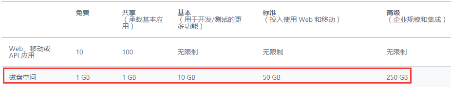
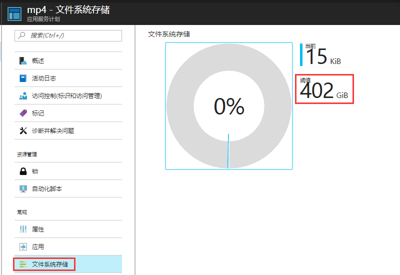

# FTP 容量显示说明

## 现象描述

Azure 门户显示的文件系统存储容量跟网站本身的磁盘空间不符。

## 问题分析

Azure Web 应用的文件系统存储用量和网站本身有关,具体容量如下所示：

但目前门户预览中关于 FTP 的容量是以资源组为单位计算的，举例如下：
同一资源下有 10 个定价层：8 个标准模式、1 个共享模式以及一个免费模式的定价层：

点击这 10 个定价层的任意一个，存储容量显示的都是 402G:50x8+1+1：

