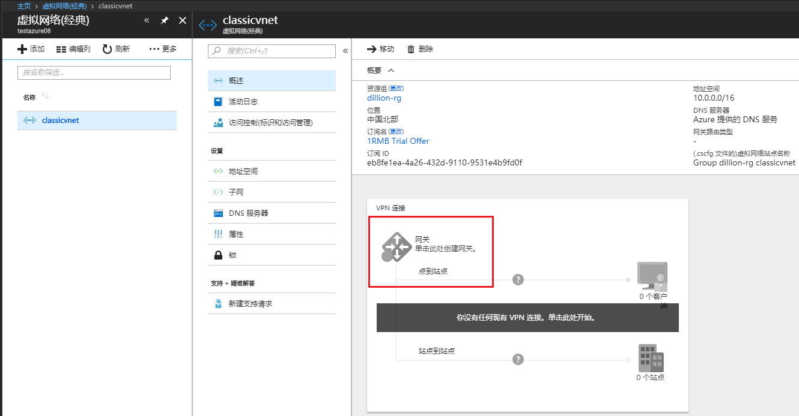
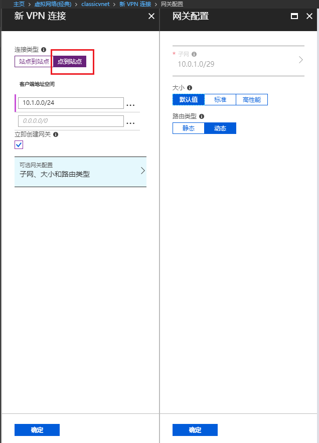
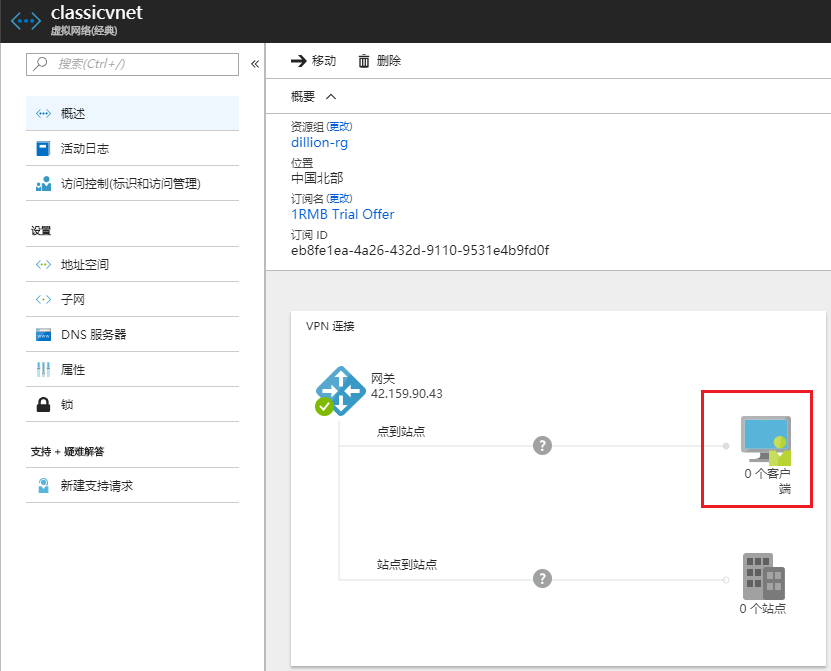
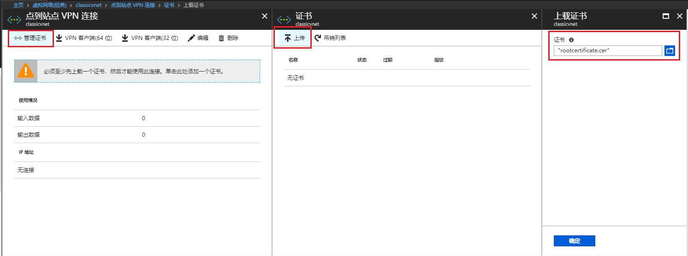
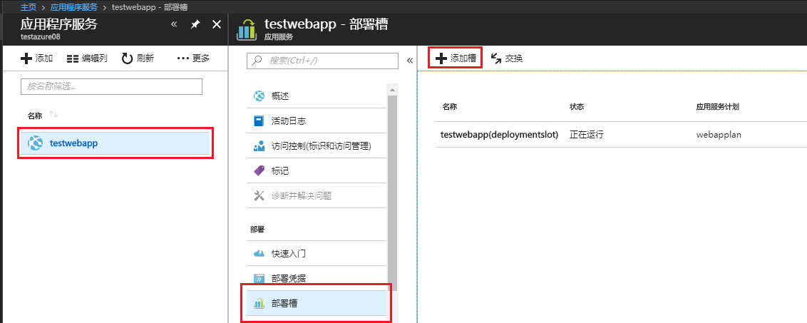
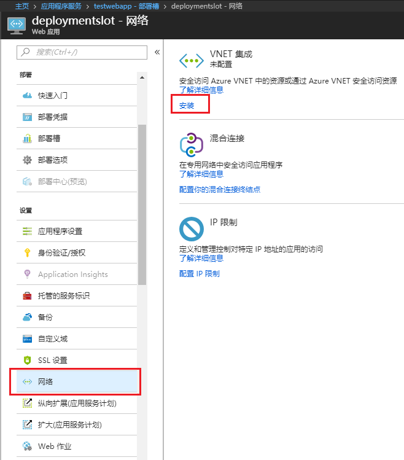
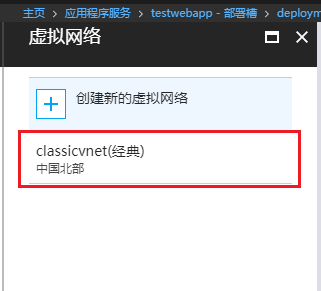
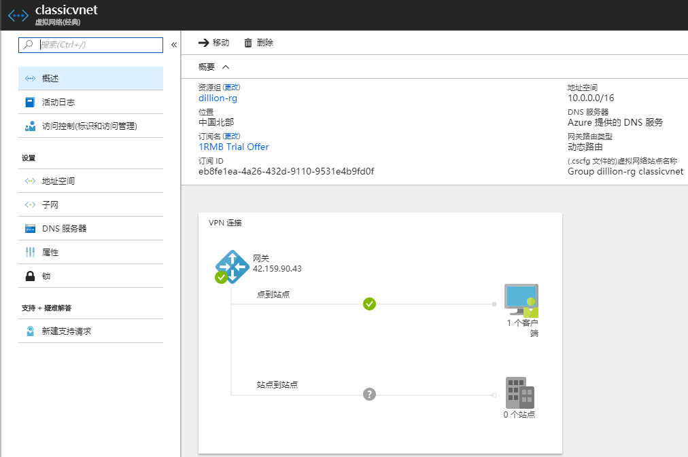

# 如何将 Web 应用部署槽连接到 Azure 经典虚拟网络

## 准备工作

- Web 应用处于标准或高级的定价层
- 具有点到站点连接配置网关的经典虚拟网络
- [为点到站点连接生成和导出证书](https://docs.azure.cn/vpn-gateway/vpn-gateway-certificates-point-to-site)
## 操作步骤

通过以下步骤完成 Web 应用部署槽连接到虚拟网络：

1. 登录 [Azure 门户](https://portal.azure.cn)

2. 打开 Azure 虚拟网络(经典)服务，选择经典虚拟网络，为虚拟机网络创建网关，配置点到站点连接。

    

    

    创建完成后，点击客户端，添加客户端证书。

    

    

3. 打开应用程序服务，在选中应用侧边栏中点击“部署槽”，点击“添加槽”按钮添加部署槽。

    

    添加成功后，点击添加的部署槽，在部署槽侧边栏菜单中选择“网络”，点击“安装”按钮选择虚拟网络集成 Vnet

    

    

4. 执行成功后，等待几分钟，就可以通过 Portal 看到 VNET 中已经连接了一个客户端。

    