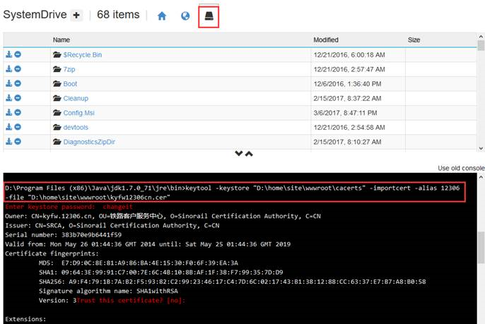
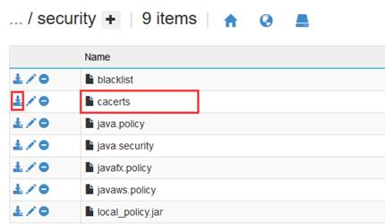

# Azure Web 应用中 Java 如何加载证书

Java 是可以自己指定证书库的所在位置的，无论是在本地或者 Azure 上都可以将加载过证书库的文件上传，然后通过程序指定要加载的证书库。

## 操作步骤

1. 登录网站的 kudu 站点。

    https://[网站名].scm.chinacloudsites.cn/DebugConsole

2. 把证书库和需要加载的证书放到相应的位置。

    

3. 切换命令行到 keytool 所在的位置，在命令行运行加载证书的命令 :

    

4.	加载完毕以后，在程序中或者配置文件中指定要加载的信任库即可 :

    ```
    System.setProperty ("javax.net.ssl.trustStore", trustStorePath); 
    ```

5.	如果担心证书库不全，也可以直接从 Azure 上直接下载证书库，然后将此文件导入 :

    

关于 .net 下如何加载证书方式请参考[文档](https://azure.microsoft.com/en-us/blog/using-certificates-in-azure-websites-applications/)。