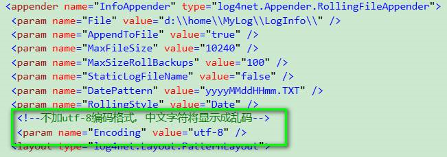
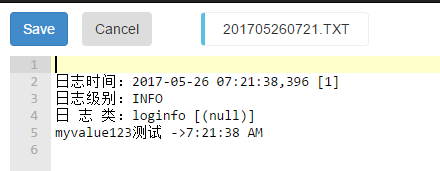
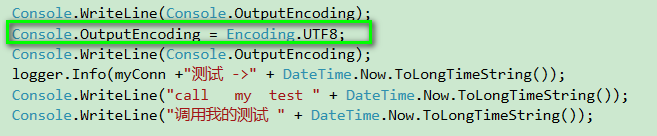
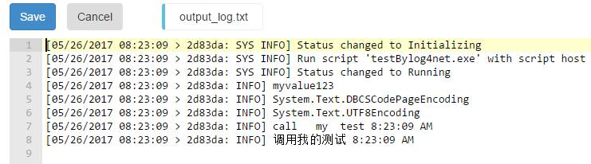

# 如何解决 Azure Web 应用日志内容显示乱码的问题

## 问题描述

Azure Web 应用日志信息在本地测试显示正常，但部署到 Azure 后显示乱码。

## 问题分析

因为 Azure 是一个英文环境，所以在使用 log4net 等工具或者 console 打印日志的时候，不指定 encoding 的话，中文就会显示乱码。

## 解决方法

- 指定 encoding 信息，比如 log4net:

    

    部署到 WebJobs 后，日志显示正常：

    

- Console 相关：在代码中都是可以配置编码规则的：

    

    WebJobs 显示的日志正常：

    