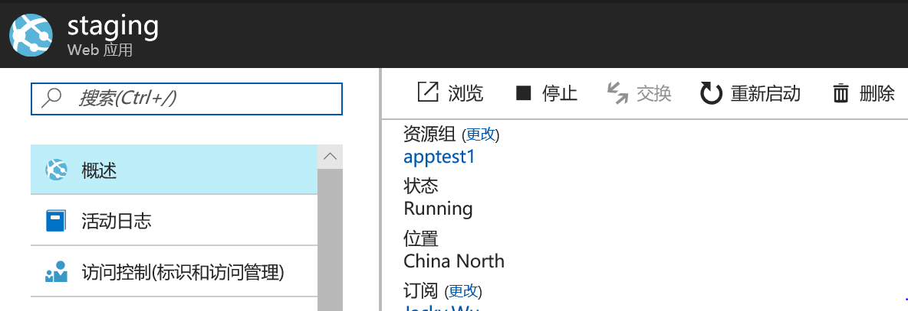

# 含有部署槽的标准网站无法缩放到基本模式

## 问题现象

在缩放时，会出现如下错误“站点 ‘testforeast’ 超过了托管计划允许的最大槽数。请在缩放到另一模式前删除所有部署槽。”

> [!NOTE]
> 在向下缩放资源时，需要检查目前模式下的资源配置是否超过目标定价层的限制。例如：存储的大小、实例的部署槽等因素。

## 解决方法

由于基本模式的网站不支持部署槽功能，需要删除部署槽才能成功缩放到基本模式。

> [!NOTE]
> 另外还需要注意存储的大小是否超过了限制。

找到所有的部署槽并点击 “**删除**” 按钮后，即可成功将服务计划缩放到基本模式。

